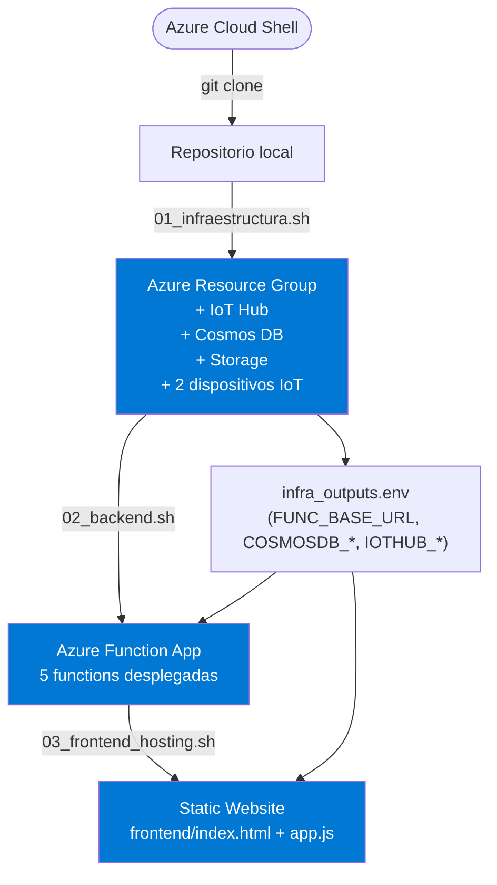
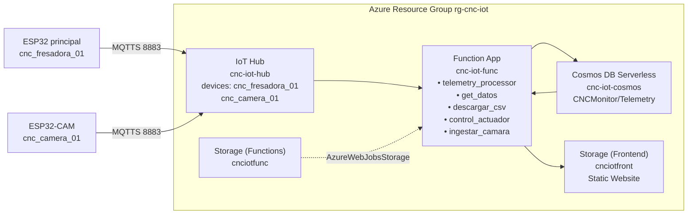

# Deploy del proyecto IoT_CNC_Monitoring desde Azure Cloud Shell

Este documento describe el uso de los scripts de la carpeta `Deploy/` del repositorio `Deivs117/IoT_CNC_Monitoring` para aprovisionar infraestructura, desplegar backend y publicar el frontend, trabajando directamente desde **Azure Cloud Shell** en el portal de Azure.

La guía está pensada para que el despliegue sea:

- repetible,
- práctico,
- seguro,
- fácil de ejecutar desde navegador,
- resistente a desconexiones de sesión.

---

## Flujo de despliegue completo



## Infraestructura desplegada



---

# 1. Objetivo de esta carpeta

La carpeta `Deploy/` contiene scripts Bash para automatizar el despliegue cloud del sistema.

## Scripts incluidos

| Script | Propósito |
|---|---|
| `01_infraestructura.sh` | Aprovisiona la infraestructura base en Azure |
| `02_backend.sh` | Crea y despliega Azure Functions |
| `03_frontend_hosting.sh` | Publica el frontend estático |
| `04_cleanup.sh` | Elimina todo el entorno desplegado |
| `deploy.sh` | Orquestador principal del flujo completo o parcial |
| `infra_outputs.env.template` | Plantilla de referencia para variables y outputs |

---

# 2. Qué despliega exactamente

## Infraestructura y componentes

Los scripts permiten desplegar:

- **Azure Resource Group**
- **Azure IoT Hub**
- **Registro de dos dispositivos ESP32** (`cnc_fresadora_01` y `cnc_camera_01`)
- **Azure Cosmos DB (Serverless)**
- **Azure Function App**
- **Storage Account para Azure Functions**
- **Storage Account para hosting estático del frontend**
- **Configuración inicial de CORS**
- **Inyección de variables para el frontend**

---

# 3. Escenario recomendado de uso

Dado que el despliegue se hará desde la **terminal Shell del portal de Azure**, el flujo recomendado es:

1. Abrir **Azure Cloud Shell** en modo **Bash**
2. Clonar el repositorio
3. Cargar/exportar secretos
4. Ejecutar scripts desde `Deploy/`
5. Respaldar archivos sensibles para no perderlos si la sesión se desconecta

---

# 4. Requisitos previos

Antes de ejecutar el despliegue, asegúrate de tener:

- acceso al portal de Azure,
- permisos suficientes sobre la suscripción,
- acceso a **Azure Cloud Shell**,
- `git` disponible,
- `az` CLI autenticado,
- Azure Functions Core Tools disponibles si vas a publicar Functions desde Cloud Shell.

---

# 5. Abrir Azure Cloud Shell

1. Entra al portal de Azure.
2. Haz clic en el icono de **Cloud Shell**.
3. Selecciona **Bash**.
4. Espera a que la terminal termine de cargar.

> Importante: usa **Bash**, no PowerShell, porque todos los scripts de esta carpeta están escritos para shell Bash.

---

# 6. Clonar el repositorio

Desde Azure Cloud Shell:

```bash
cd ~
git clone https://github.com/Deivs117/IoT_CNC_Monitoring.git
cd IoT_CNC_Monitoring
```

Verifica que la carpeta exista correctamente:

```bash
ls -la
ls -la Deploy
```

# 7. Orden natural del despliegue

La secuencia recomendada para desplegar el proyecto es la siguiente:

## Opción A: ejecución paso a paso

```bash
cd ~/IoT_CNC_Monitoring/Deploy

bash 01_infraestructura.sh
bash 02_backend.sh
bash 03_frontend_hosting.sh
```

## Opción B: uso del orquestador principal

```bash
cd ~/IoT_CNC_Monitoring/Deploy

bash deploy.sh
```

## Opción C: despliegue parcial

### Solo infraestructura

```bash
cd ~/IoT_CNC_Monitoring/Deploy

bash deploy.sh --only-infra
```

### Solo backend

```bash
cd ~/IoT_CNC_Monitoring/Deploy

bash deploy.sh --only-backend
```

### Solo frontend

```bash
cd ~/IoT_CNC_Monitoring/Deploy

bash deploy.sh --only-front
```

### Omitir infraestructura

```bash
cd ~/IoT_CNC_Monitoring/Deploy

bash deploy.sh --no-infra
```

### Omitir backend

```bash
cd ~/IoT_CNC_Monitoring/Deploy

bash deploy.sh --no-backend
```

### Omitir frontend

```bash
cd ~/IoT_CNC_Monitoring/Deploy

bash deploy.sh --no-front
```

---

# Hacer ejecutables todos los scripts `.sh`

Si quieres ejecutar los scripts directamente con `./nombre_script.sh`, primero debes darles permisos de ejecución.

## Comando para hacer ejecutables todos los scripts de `Deploy/`

```bash
cd ~/IoT_CNC_Monitoring/Deploy

chmod +x *.sh
```

## Verificar permisos

```bash
ls -l *.sh
```

## Ejecutar después de dar permisos

```bash
./01_infraestructura.sh
./02_backend.sh
./03_frontend_hosting.sh
./04_cleanup.sh
./deploy.sh
```

---

# Recomendación práctica

Aunque los hagas ejecutables, para evitar errores de ruta o de contexto, sigue siendo buena práctica ejecutar desde la carpeta `Deploy/`:

```bash
cd ~/IoT_CNC_Monitoring/Deploy
./deploy.sh
```

O si prefieres no depender de permisos:

```bash
cd ~/IoT_CNC_Monitoring/Deploy
bash deploy.sh
```

# 8. Consideraciones importantes sobre Azure Cloud Shell

Azure Cloud Shell puede cerrar la sesión visual si:

- se cierra la pestaña del navegador,
- se interrumpe la conexión,
- expira la sesión web,
- se recarga el portal.

## Qué se conserva y qué no

### Normalmente se conserva
- los archivos guardados en tu directorio personal (`~`),
- el repositorio clonado,
- los archivos `.env` o `.sh` que guardes manualmente.

### No se conserva automáticamente
- las variables exportadas solo con `export`,
- el contexto temporal de la sesión shell,
- valores no guardados a disco.

## Conclusión práctica
Si exportas secretos únicamente con `export`, los perderás cuando se cierre la sesión.  
Por eso, la práctica correcta es:

- guardar los secretos en un archivo privado,
- luego usar `source` para cargarlos cuando sea necesario.

---

# 9. Variables y secretos que pueden intervenir

## Variables más importantes

Estas variables pueden ser necesarias durante el despliegue:

- `TELEGRAM_BOT_TOKEN`
- `TELEGRAM_CHAT_ID`

Y opcionalmente puedes sobreescribir nombres de recursos:

- `RG_NAME`
- `LOCATION`
- `IOT_HUB_NAME`
- `IOT_DEVICE_ID`
- `COSMOS_ACCOUNT`
- `FUNC_APP_NAME`
- `FUNC_STORAGE`
- `FRONTEND_SA`

Si no defines estas variables, los scripts usarán sus valores por defecto.

---

# 10. Método recomendado para exportar secretos sin perderlos

La mejor práctica en Azure Cloud Shell es usar un archivo persistente con permisos restringidos.

## Paso 1: crear un archivo privado de secretos

```bash
cat > ~/iot_cnc_secrets.env <<'EOF'
export TELEGRAM_BOT_TOKEN="TU_TOKEN_REAL"
export TELEGRAM_CHAT_ID="TU_CHAT_ID_REAL"

# Opcionales: overrides de nombres o región
export RG_NAME="rg-cnc-iot"
export LOCATION="eastus"
export IOT_HUB_NAME="cnc-iot-hub"
export IOT_DEVICE_ID="cnc_fresadora_01"
export COSMOS_ACCOUNT="cnc-iot-cosmos"
export FUNC_APP_NAME="cnc-iot-func"

# INSTANCE_SUFFIX: sufijo corto y legible para Storage Accounts globalmente únicos.
# Elige un valor estable y corto (ej. iniciales o alias del proyecto).
# Con INSTANCE_SUFFIX="deivid" se crean: cnciotfuncdeivid, cnciotfrontdeivid
export INSTANCE_SUFFIX="deivid"
EOF
```

## Paso 2: proteger el archivo

```bash
chmod 600 ~/iot_cnc_secrets.env
```

## Paso 3: cargar las variables en la sesión actual

```bash
source ~/iot_cnc_secrets.env
```

## Paso 4: verificar que cargaron

```bash
echo "$RG_NAME"
echo "$LOCATION"
echo "$FUNC_APP_NAME"
```

> Recomendación: no imprimas tokens sensibles en pantalla salvo que sea estrictamente necesario.

---

# 11. Cómo evitar perder variables si se desconecta la terminal

Si Azure Cloud Shell se desconecta, las variables cargadas con `export` desaparecen de la sesión.

## Para recuperarlas
Solo necesitas volver a ejecutar:

```bash
source ~/iot_cnc_secrets.env
```

Esto restaurará tus variables de entorno.

---

# 12. Cómo cargar automáticamente los secretos al abrir Cloud Shell

Si quieres automatizar la carga en futuras sesiones, puedes agregar esto a `~/.bashrc`:

```bash
if [ -f "$HOME/iot_cnc_secrets.env" ]; then
  source "$HOME/iot_cnc_secrets.env"
fi
```

Puedes hacerlo así:

```bash
echo 'if [ -f "$HOME/iot_cnc_secrets.env" ]; then source "$HOME/iot_cnc_secrets.env"; fi' >> ~/.bashrc
source ~/.bashrc
```

## Ventaja
Cada nueva sesión Bash cargará tus variables automáticamente.

## Precaución
Haz esto solo si:
- tu Cloud Shell es de uso personal,
- entiendes que esos secretos quedarán disponibles automáticamente en nuevas sesiones.

---

# 13. Archivo `infra_outputs.env` y por qué es tan importante

El script `01_infraestructura.sh` genera el archivo:

```bash
Deploy/infra_outputs.env
```

Este archivo contiene:

- nombres de recursos creados,
- cadenas de conexión,
- outputs intermedios del despliegue,
- placeholders para URL del backend,
- placeholders para URL del frontend,
- valores reutilizados por `02_backend.sh` y `03_frontend_hosting.sh`.

## Importante
Este archivo:

- contiene datos sensibles,
- no debe subirse al repositorio,
- debe mantenerse con permisos restringidos.

El script le aplica:

```bash
chmod 600 Deploy/infra_outputs.env
```

---

# 14. Respaldo recomendado de `infra_outputs.env`

Después de ejecutar `01_infraestructura.sh` o `deploy.sh`, crea una copia adicional:

```bash
cp Deploy/infra_outputs.env ~/infra_outputs.env.backup
chmod 600 ~/infra_outputs.env.backup
```

Esto te protege en caso de:

- borrar accidentalmente el repo clonado,
- sobreescribir el archivo,
- ejecutar limpieza local,
- cometer errores al editar.

## Restauración

```bash
cp ~/infra_outputs.env.backup ~/IoT_CNC_Monitoring/Deploy/infra_outputs.env
chmod 600 ~/IoT_CNC_Monitoring/Deploy/infra_outputs.env
```

---

# 15. Uso detallado de cada script

---

# 15.1 `01_infraestructura.sh`

## Qué hace

Crea la infraestructura base en Azure:

- Resource Group
- IoT Hub
- registro del dispositivo ESP32
- Cosmos DB en modo Serverless
- base de datos `CNCMonitor`
- contenedor `Telemetry`
- Storage Account para Functions
- Storage Account para frontend

También genera:

```bash
Deploy/infra_outputs.env
```

## Cómo ejecutarlo

Desde la raíz del repo:

```bash
bash Deploy/01_infraestructura.sh
```

O desde la carpeta `Deploy/`:

```bash
cd Deploy
bash 01_infraestructura.sh
```

## Variables de entrada opcionales

Puedes definir antes de ejecutarlo:

- `RG_NAME`
- `LOCATION`
- `IOT_HUB_NAME`
- `IOT_DEVICE_ID`
- `COSMOS_ACCOUNT`
- `FUNC_APP_NAME`
- `FUNC_STORAGE`
- `FRONTEND_SA`
- `TELEGRAM_BOT_TOKEN`
- `TELEGRAM_CHAT_ID`

## Qué genera

El archivo `infra_outputs.env` contendrá variables como:

- `RG_NAME`
- `LOCATION`
- `IOT_HUB_NAME`
- `IOT_DEVICE_ID`
- `IOTHUB_EVENTS_CONNECTION_STRING`
- `IOTHUB_SERVICE_CONNECTION_STRING`
- `IOT_HUB_EVENTHUB_NAME`
- `COSMOSDB_CONNECTION`
- `FUNC_STORAGE_CONN`
- `FUNC_BASE_URL` (placeholder inicialmente)
- `FUNC_KEY` (placeholder inicialmente)
- `FRONTEND_URL` (placeholder inicialmente)

## Verificación recomendada

```bash
ls -l Deploy/infra_outputs.env
cp Deploy/infra_outputs.env ~/infra_outputs.env.backup
```

---

# 15.2 `02_backend.sh`

## Qué hace

Este script:

1. crea el Function App,
2. configura App Settings,
3. publica el código desde `backend/azure_functions/`,
4. obtiene la URL base del backend,
5. obtiene la function key por defecto,
6. actualiza `Deploy/infra_outputs.env`.

## Cómo ejecutarlo

```bash
bash Deploy/02_backend.sh
```

## Requisitos previos

Debe existir:

```bash
Deploy/infra_outputs.env
```

Ese archivo debe haber sido generado por `01_infraestructura.sh`.

## Variables requeridas

Se validan internamente, entre otras:

- `RG_NAME`
- `LOCATION`
- `FUNC_APP_NAME`
- `FUNC_STORAGE`
- `FUNC_STORAGE_CONN`
- `IOTHUB_EVENTS_CONNECTION_STRING`
- `IOTHUB_SERVICE_CONNECTION_STRING`
- `IOT_HUB_EVENTHUB_NAME`
- `IOT_DEVICE_ID`
- `COSMOSDB_CONNECTION`

## Qué actualiza en `infra_outputs.env`

- `FUNC_BASE_URL`
- `FUNC_KEY`

## Verificación recomendada

```bash
grep FUNC_BASE_URL Deploy/infra_outputs.env
grep FUNC_KEY Deploy/infra_outputs.env
```

> Recomendación: evita hacer `cat Deploy/infra_outputs.env` completo si estás compartiendo pantalla.

---

# 15.3 `03_frontend_hosting.sh`

## Qué hace

Este script:

1. habilita Static Website en la storage account del frontend,
2. copia el frontend a un directorio temporal,
3. inyecta `API_BASE_URL` y `API_FUNCTION_KEY` en `app.js`,
4. sube los archivos al contenedor `$web`,
5. actualiza CORS del Function App,
6. guarda `FRONTEND_URL` en `infra_outputs.env`.

## Cómo ejecutarlo

```bash
bash Deploy/03_frontend_hosting.sh
```

## Requisitos previos

Debe existir:

```bash
Deploy/infra_outputs.env
```

Y debe contener, como mínimo:

- `FRONTEND_SA`
- `FUNC_BASE_URL`
- `FUNC_APP_NAME`
- `RG_NAME`

Idealmente también:

- `FUNC_KEY`

## Qué actualiza

Agrega o actualiza:

- `FRONTEND_URL`

## Resultado esperado

Al finalizar deberías tener una URL del dashboard similar a:

```text
https://<storage-account>.z13.web.core.windows.net
```

---

# 15.4 `04_cleanup.sh`

## Qué hace

Elimina el Resource Group completo y todos sus recursos asociados.

## Cómo ejecutarlo

Con confirmación interactiva:

```bash
bash Deploy/04_cleanup.sh
```

Sin confirmación:

```bash
FORCE_CLEANUP=true bash Deploy/04_cleanup.sh
```

## Qué elimina

- IoT Hub
- Cosmos DB
- Function App
- Storage Accounts
- demás recursos dentro del Resource Group

También elimina el archivo local:

```bash
Deploy/infra_outputs.env
```

## Recomendación antes de ejecutarlo

Haz una copia del archivo si necesitas conservar referencia:

```bash
cp Deploy/infra_outputs.env ~/infra_outputs.env.pre_cleanup.backup
chmod 600 ~/infra_outputs.env.pre_cleanup.backup
```

---

# 15.5 `deploy.sh`

## Qué hace

Es el orquestador principal del despliegue.

Ejecuta en orden:

1. infraestructura
2. backend
3. frontend

## Cómo ejecutarlo

Despliegue completo:

```bash
cd Deploy
bash deploy.sh
```

## Flags disponibles

### Solo infraestructura

```bash
bash deploy.sh --only-infra
```

### Solo backend

```bash
bash deploy.sh --only-backend
```

### Solo frontend

```bash
bash deploy.sh --only-front
```

### Omitir infraestructura

```bash
bash deploy.sh --no-infra
```

### Omitir backend

```bash
bash deploy.sh --no-backend
```

### Omitir frontend

```bash
bash deploy.sh --no-front
```

---

# 16. Flujo recomendado completo desde Azure Cloud Shell

## Paso 1: abrir Cloud Shell
Abre Azure Cloud Shell en modo Bash.

## Paso 2: clonar el repositorio

```bash
cd ~
git clone https://github.com/Deivs117/IoT_CNC_Monitoring.git
cd IoT_CNC_Monitoring
```

## Paso 3: crear archivo persistente de secretos

```bash
cat > ~/iot_cnc_secrets.env <<'EOF'
export TELEGRAM_BOT_TOKEN="TU_TOKEN"
export TELEGRAM_CHAT_ID="TU_CHAT_ID"
export RG_NAME="rg-cnc-iot"
export LOCATION="eastus"
export IOT_HUB_NAME="cnc-iot-hub"
export IOT_DEVICE_ID="cnc_fresadora_01"
export COSMOS_ACCOUNT="cnc-iot-cosmos"
export FUNC_APP_NAME="cnc-iot-func"
export INSTANCE_SUFFIX="deivid"
EOF

chmod 600 ~/iot_cnc_secrets.env
source ~/iot_cnc_secrets.env
```

## Paso 4: ejecutar despliegue completo

```bash
cd ~/IoT_CNC_Monitoring/Deploy
bash deploy.sh
```

## Paso 5: respaldar outputs

```bash
cp infra_outputs.env ~/infra_outputs.env.backup
chmod 600 ~/infra_outputs.env.backup
```

## Paso 6: si se desconecta la terminal

Cuando vuelvas a abrir Cloud Shell:

```bash
cd ~/IoT_CNC_Monitoring
source ~/iot_cnc_secrets.env
cd Deploy
```

Si necesitas restaurar outputs:

```bash
cp ~/infra_outputs.env.backup ~/IoT_CNC_Monitoring/Deploy/infra_outputs.env
chmod 600 ~/IoT_CNC_Monitoring/Deploy/infra_outputs.env
```

---

# 17. Uso de `infra_outputs.env.template`

El archivo:

```bash
Deploy/infra_outputs.env.template
```

es una plantilla de referencia que documenta las variables relevantes del despliegue.

## Cuándo usarlo

Sirve para:

- entender qué variables maneja el sistema,
- reconstruir manualmente `infra_outputs.env`,
- depurar despliegues,
- revisar el naming esperado de variables.

## Importante
En el flujo normal **no necesitas rellenarlo manualmente**, porque:

- `01_infraestructura.sh` genera automáticamente `infra_outputs.env`.

---

# 18. Persistencia recomendada de secretos y variables

## Archivos que conviene conservar

### Archivo de secretos
```bash
~/iot_cnc_secrets.env
```

### Backup del output de infraestructura
```bash
~/infra_outputs.env.backup
```

## Permisos recomendados

```bash
chmod 600 ~/iot_cnc_secrets.env
chmod 600 ~/infra_outputs.env.backup
```

## Recarga rápida en una nueva sesión

```bash
source ~/iot_cnc_secrets.env
```

## Restauración rápida del archivo de outputs

```bash
cp ~/infra_outputs.env.backup ~/IoT_CNC_Monitoring/Deploy/infra_outputs.env
chmod 600 ~/IoT_CNC_Monitoring/Deploy/infra_outputs.env
```

---

# 19. Buenas prácticas de seguridad

1. No subas nunca a Git:
   - `Deploy/infra_outputs.env`
   - `~/iot_cnc_secrets.env`
   - backups con secretos
2. Evita imprimir secretos en pantalla.
3. Usa `chmod 600` en todos los archivos sensibles.
4. No copies tokens en comandos innecesarios.
5. Si compartes pantalla o haces grabación, evita ejecutar:
   ```bash
   cat Deploy/infra_outputs.env
   ```
6. Usa siempre backups cuando completes aprovisionamiento o backend.

---

# 20. Comandos rápidos útiles

## Recargar secretos
```bash
source ~/iot_cnc_secrets.env
```

## Restaurar outputs
```bash
cp ~/infra_outputs.env.backup ~/IoT_CNC_Monitoring/Deploy/infra_outputs.env
chmod 600 ~/IoT_CNC_Monitoring/Deploy/infra_outputs.env
```

## Ejecutar solo infraestructura
```bash
cd ~/IoT_CNC_Monitoring/Deploy
source ~/iot_cnc_secrets.env
bash deploy.sh --only-infra
```

## Ejecutar solo backend
```bash
cd ~/IoT_CNC_Monitoring/Deploy
source ~/iot_cnc_secrets.env
bash deploy.sh --only-backend
```

## Ejecutar solo frontend
```bash
cd ~/IoT_CNC_Monitoring/Deploy
bash deploy.sh --only-front
```

## Eliminar todo el entorno
```bash
cd ~/IoT_CNC_Monitoring/Deploy
bash 04_cleanup.sh
```

---

# 21. Troubleshooting

## Problema: `infra_outputs.env` no existe
### Causa probable
No se ejecutó `01_infraestructura.sh`.

### Solución
```bash
cd ~/IoT_CNC_Monitoring/Deploy
bash 01_infraestructura.sh
```

---

## Problema: `02_backend.sh` dice que faltan variables
### Causa probable
`infra_outputs.env` está incompleto o no fue generado correctamente.

### Solución
Verifica:
```bash
ls -l Deploy/infra_outputs.env
```

Si es necesario, regenera:
```bash
bash Deploy/01_infraestructura.sh
```

---

## Problema: perdiste la sesión de Cloud Shell
### Solución
Vuelve a entrar y recarga:

```bash
cd ~/IoT_CNC_Monitoring
source ~/iot_cnc_secrets.env
cd Deploy
```

Si hace falta restaurar outputs:
```bash
cp ~/infra_outputs.env.backup ~/IoT_CNC_Monitoring/Deploy/infra_outputs.env
chmod 600 ~/IoT_CNC_Monitoring/Deploy/infra_outputs.env
```

---

## Problema: el frontend despliega pero no conecta con backend
### Posibles causas
- `FUNC_BASE_URL` vacío
- `FUNC_KEY` vacío
- CORS incorrecto
- `03_frontend_hosting.sh` ejecutado antes de `02_backend.sh`

### Solución recomendada
Verifica en `infra_outputs.env`:
- `FUNC_BASE_URL`
- `FUNC_KEY`
- `FRONTEND_URL`

Luego vuelve a correr:

```bash
bash Deploy/02_backend.sh
bash Deploy/03_frontend_hosting.sh
```

---

## Problema: Telegram no funciona
### Causa probable
Variables no cargadas:
- `TELEGRAM_BOT_TOKEN`
- `TELEGRAM_CHAT_ID`

### Solución
Verifica tu archivo:

```bash
cat ~/iot_cnc_secrets.env
```

Corrige si es necesario, luego:

```bash
source ~/iot_cnc_secrets.env
bash Deploy/02_backend.sh
```

---

# 22. Recomendación final

Para trabajar cómodamente desde Azure Cloud Shell, la estrategia más robusta es esta:

- clonar el repositorio en Cloud Shell,
- mantener un archivo persistente de secretos:
  ```bash
  ~/iot_cnc_secrets.env
  ```
- mantener un backup del archivo de outputs:
  ```bash
  ~/infra_outputs.env.backup
  ```
- usar `source` al reconectar,
- usar `deploy.sh` como punto de entrada principal.

Esto permite un flujo práctico, repetible y resistente a desconexiones sin depender de recordar manualmente variables sensibles.

---

# 23. Checklist rápido antes de desplegar

- [ ] Abrí Azure Cloud Shell en modo Bash
- [ ] Cloné el repositorio
- [ ] Creé `~/iot_cnc_secrets.env` (incluye `INSTANCE_SUFFIX`)
- [ ] Protegí el archivo con `chmod 600`
- [ ] Ejecuté `source ~/iot_cnc_secrets.env`
- [ ] Entré a `~/IoT_CNC_Monitoring/Deploy`
- [ ] Ejecuté `bash deploy.sh`
- [ ] Guardé backup de `infra_outputs.env`

---

# 24. Convención de nomenclatura de recursos Azure

Todos los recursos del proyecto siguen una convención legible y predecible:

| Recurso | Nombre | Notas |
|---|---|---|
| Resource Group | `rg-cnc-iot` | Prefijo `rg-` estándar Azure |
| IoT Hub | `cnc-iot-hub` | Fijo y legible |
| Dispositivo | `cnc_fresadora_01` | Underscore (restricción IoT Hub) |
| Cosmos DB Account | `cnc-iot-cosmos` | Fijo y legible |
| Cosmos DB | `CNCMonitor` | Base de datos lógica |
| Contenedor | `Telemetry` | Partición `/device_id` |
| Function App | `cnc-iot-func` | Fijo y legible |
| Storage (Functions) | `cnciotfunc<INSTANCE_SUFFIX>` | Sufijo para unicidad global |
| Storage (Frontend) | `cnciotfront<INSTANCE_SUFFIX>` | Sufijo para unicidad global |

`INSTANCE_SUFFIX` debe ser un alias corto, alfanumérico, minúscula, fácil de recordar
(ej. `deivid`, `prod`, `dev01`). Se define una vez en `~/iot_cnc_secrets.env` y se
mantiene estable entre ejecuciones.

Si no se define `INSTANCE_SUFFIX`, el script `01_infraestructura.sh` genera un sufijo
de 6 caracteres (SHA256 truncado del `RG_NAME`) que es determinista entre ejecuciones
del mismo entorno pero menos legible.

---

# 25. Configuración del firmware tras el despliegue

Tras ejecutar `01_infraestructura.sh`, configura el firmware del ESP32:

## Obtener credenciales del dispositivo

```bash
# FQDN del IoT Hub (copiar en config.h → IOT_HUB_HOST)
echo "cnc-iot-hub.azure-devices.net"

# Clave primaria del dispositivo (copiar en config.h → DEVICE_PRIMARY_KEY)
az iot hub device-identity show \
  --hub-name cnc-iot-hub \
  --device-id cnc_fresadora_01 \
  --query "authentication.symmetricKey.primaryKey" \
  --output tsv
```

## Actualizar config.h

```cpp
constexpr char IOT_HUB_HOST[]       = "cnc-iot-hub.azure-devices.net";
constexpr char DEVICE_ID[]          = "cnc_fresadora_01";
constexpr char DEVICE_PRIMARY_KEY[] = "<clave_primaria_obtenida_arriba>";
constexpr char WIFI_SSID[]          = "TU_SSID";
constexpr char WIFI_PASSWORD[]      = "TU_PASSWORD";
```

## Instalar la librería de Edge Impulse en Arduino IDE

1. Descarga el `.zip` desde Edge Impulse Studio:
   `Deployment → Arduino library → CNC_Monitor_Project_inferencing`
2. En Arduino IDE: `Sketch → Include Library → Add .ZIP Library`
3. Selecciona el `.zip` descargado.
4. Verifica que `CNC_Monitor_Project_inferencing.h` esté disponible.

## Compilar y cargar

El firmware compilará contra el SDK de Edge Impulse y publicará directamente
a Azure IoT Hub (MQTTS, puerto 8883) con SAS token generado en el dispositivo.

---