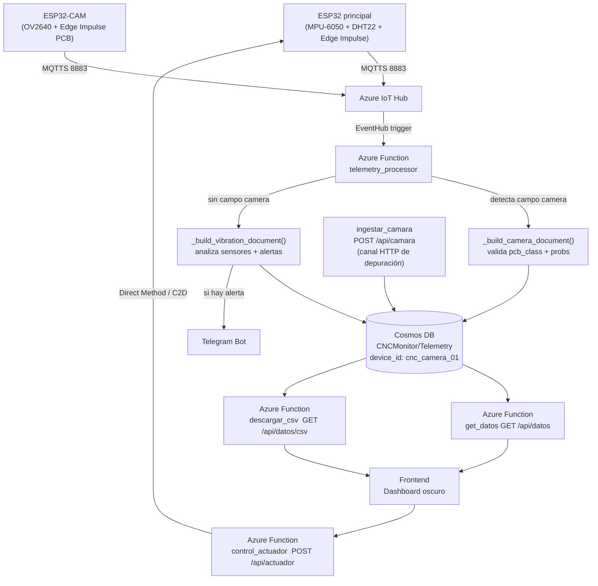
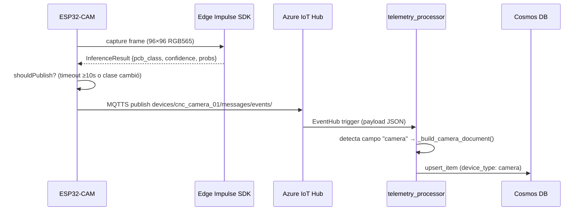
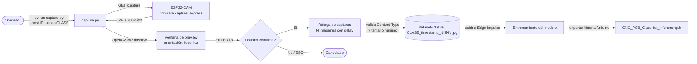

# IoT CNC PCB Monitor

Sistema IoT + Edge AI + Serverless para monitoreo analítico y preventivo de una fresadora CNC usada en manufactura de PCBs.

---

## 1. Objetivo del proyecto

`IoT_CNC_Monitoring` integra firmware embebido, funciones serverless en Azure y un dashboard web para detectar en tiempo real desviaciones de temperatura, humedad y vibración que puedan dañar placas de cobre o romper herramientas.

El sistema incorpora además un **nodo ESP32-CAM independiente** con visión artificial Edge AI (Edge Impulse) para clasificar automáticamente el tipo de PCB posicionada en la bancada de la CNC, determinando la ruta de manufactura correspondiente.

---

## 2. Arquitectura de la solución



> **Nota:** `telemetry_processor` detecta automáticamente el tipo de payload: si contiene el campo `camera` lo trata como telemetría de la ESP32-CAM; de lo contrario lo procesa como telemetría del nodo principal (vibración/sensores). Ambos tipos coexisten en el mismo contenedor Cosmos DB identificados por `device_id`.

---

## 3. Estructura del repositorio

```text
IoT_CNC_Monitoring/
├── .gitignore
├── README.md
├── firmware/
│   ├── cnc_main_node/              ← Nodo principal ESP32
│   │   ├── cnc_main_node.ino
│   │   ├── config.h
│   │   ├── edge_impulse_vibration.h
│   │   └── sensors.h
│   └── cnc_camera_node/
│       ├── capture_express/        ← Firmware de captura para dataset
│       │   └── capture_express.ino   (GET /capture → JPEG crudo)
│       ├── dataset_capture/        ← Automatización Python con UV/Astral
│       │   ├── pyproject.toml
│       │   ├── capture.py          (descarga imágenes por clase)
│       │   └── README.md
│       └── cnc_camera_node/        ← Firmware de inferencia Edge Impulse
│           └── cnc_camera_node.ino   (clasifica PCB + publica cada 10s)
├── backend/
│   ├── README.md                   ← Documentación del backend
│   ├── mqtt_bridge.py              ← Puente Mosquitto → Azure IoT Hub
│   ├── requirements.txt            ← Dependencias del bridge (paho-mqtt, azure-iot-device)
│   └── azure_functions/            ← Raíz del Function App
│       ├── host.json
│       ├── local.settings.json     ← Variables locales (no commitear con valores reales)
│       ├── requirements.txt        ← Dependencias para despliegue en Azure
│       ├── shared_code/
│       │   ├── __init__.py
│       │   └── alerts.py           ← Umbrales + Telegram Bot API
│       ├── telemetry_processor/    ← Ingestión IoT Hub → Cosmos DB
│       │   ├── __init__.py
│       │   └── function.json
│       ├── get_datos/              ← GET /api/datos
│       │   ├── __init__.py
│       │   └── function.json
│       ├── descargar_csv/          ← GET /api/datos/csv
│       │   ├── __init__.py
│       │   └── function.json
│       ├── control_actuador/       ← POST /api/actuador (ON/OFF/RESET)
│       │   ├── __init__.py
│       │   └── function.json
│       └── ingestar_camara/        ← POST /api/camara (telemetría ESP32-CAM)
│           ├── __init__.py
│           └── function.json
├── frontend/
│   ├── README.md                   ← Documentación del frontend
│   ├── index.html                  ← Dashboard oscuro CNC PCB
│   ├── app.js                      ← Lógica de UI (polling, cámara, actuador, CSV)
│   └── style.css                   ← Tema oscuro
└── Deploy/
    ├── deploy.sh                   ← Orquestador (flags: --no-infra, --no-front, etc.)
    ├── 01_infraestructura.sh       ← RG + IoT Hub + Cosmos DB Serverless + Storage Accounts
    ├── 02_backend.sh               ← Function App + App Settings + publicación
    ├── 03_frontend_hosting.sh      ← Static Website + inyección de variables + CORS
    ├── 04_cleanup.sh               ← Eliminación del entorno (confirmación interactiva)
    └── infra_outputs.env.template  ← Plantilla de variables (copiar a infra_outputs.env)
```

---

## 4. Contrato JSON de telemetría

### Nodo principal (cnc_fresadora_01)

Payload publicado por el nodo principal vía MQTTS al topic `devices/cnc_fresadora_01/messages/events/`:

```json
{
  "device_id": "cnc_fresadora_01",
  "timestamp": 1716076800,
  "sensors": {
    "temperature": 24.5,
    "humidity": 45.2,
    "vibration_status": "normal"
  },
  "predictions": {
    "vibration_anomaly_score": 0.02,
    "visual_anomaly_score": null
  }
}
```

### Nodo ESP32-CAM (cnc_camera_01)

Payload publicado por el nodo de cámara vía MQTTS al topic `devices/cnc_camera_01/messages/events/`:

```json
{
  "device_id": "cnc_camera_01",
  "timestamp": 1716076810,
  "camera": {
    "pcb_class": "PCB_SMD",
    "confidence": 0.94,
    "model_version": "1.0.0",
    "inference_ms": 312,
    "probabilities": {
      "PCB_Mixta": 0.02,
      "PCB_SMD":   0.94,
      "PCB_TH":    0.03,
      "Sin_PCB":   0.01
    }
  }
}
```

#### Clases de clasificación PCB

| Clase | Descripción |
|---|---|
| `PCB_Mixta` | PCB con componentes through-hole y SMD coexistiendo |
| `PCB_SMD`   | PCB con componentes de montaje superficial únicamente |
| `PCB_TH`    | PCB con componentes through-hole / inserción únicamente |
| `Sin_PCB`   | Bancada vacía, sin placa visible |

#### Lógica de publicación controlada (firmware)

El firmware `cnc_camera_node.ino` publica únicamente cuando:
1. Han transcurrido **≥ 10 segundos** desde la última publicación, **o**
2. La clase predicha **cambió** respecto a la última inferencia publicada.

Esto evita saturar el IoT Hub con lecturas redundantes y respeta la cuota del tier gratuito.

#### Flujo de inferencia MQTT



---

## 4b. Flujo de captura del dataset




---

## 5. Documento almacenado en Cosmos DB

### Nodo principal

```json
{
  "id": "cnc_fresadora_01-1716076800-a1b2c3d4",
  "device_id": "cnc_fresadora_01",
  "timestamp": 1716076800,
  "sensors": {
    "temperature": 24.5,
    "humidity": 45.2,
    "vibration_status": "normal"
  },
  "predictions": {
    "vibration_anomaly_score": 0.02,
    "visual_anomaly_score": null
  },
  "alerts": {
    "active": false,
    "reasons": [],
    "telegram_sent": false
  },
  "raw_payload": { "...": "..." }
}
```

### Nodo ESP32-CAM

```json
{
  "id": "cnc_camera_01-1716076810-b3c4d5e6",
  "device_id": "cnc_camera_01",
  "device_type": "camera",
  "timestamp": 1716076810,
  "camera": {
    "pcb_class": "PCB_SMD",
    "confidence": 0.94,
    "model_version": "v1",
    "inference_ms": 312,
    "probabilities": {
      "PCB_Mixta": 0.02,
      "PCB_SMD":   0.94,
      "PCB_TH":    0.03,
      "Sin_PCB":   0.01
    }
  }
}
```

Ambos documentos coexisten en el mismo contenedor `Telemetry`, diferenciados por `device_id` (partition key).

---

## 6. Azure Functions — endpoints

| Función | Trigger | Ruta | Auth |
|---|---|---|---|
| `telemetry_processor` | EventHub (IoT Hub) | — | — |
| `get_datos` | HTTP GET | `/api/datos` | function |
| `descargar_csv` | HTTP GET | `/api/datos/csv` | function |
| `control_actuador` | HTTP POST | `/api/actuador` | function |
| `ingestar_camara` | HTTP POST | `/api/camara` | function |

### `get_datos` — parámetros opcionales
| Parámetro | Tipo | Default | Descripción |
|---|---|---|---|
| `limit` | int | 100 | Máximo 500 registros |
| `device_id` | string | todos | Filtrar por dispositivo |

### `descargar_csv` — parámetros opcionales
| Parámetro | Tipo | Descripción |
|---|---|---|
| `device_id` | string | Filtrar por dispositivo |

### `control_actuador` — body JSON
```json
{ "comando": "ON" }
```
Comandos válidos: `ON`, `OFF`, `RESET`.
El `device_id` se fuerza desde `IOT_DEVICE_ID` (variable de entorno), ignorando lo que envíe el cliente.

---

## 7. Variables de entorno requeridas

Todas las variables se configuran como App Settings en Azure (nunca hardcodeadas).
Para desarrollo local, completar `backend/azure_functions/local.settings.json`.

| Variable | Descripción |
|---|---|
| `AzureWebJobsStorage` | Cadena de conexión del Storage Account de Functions |
| `FUNCTIONS_WORKER_RUNTIME` | `python` |
| `IOTHUB_EVENTS_CONNECTION_STRING` | **Endpoint Event Hub-compatible** del IoT Hub — formato `Endpoint=sb://...` (para el trigger de `telemetry_processor`) |
| `IOT_HUB_EVENTHUB_NAME` | Nombre interno del Event Hub del IoT Hub |
| `IOTHUB_SERVICE_CONNECTION_STRING` | Cadena de conexión del servicio IoT Hub — formato `HostName=...` (para Direct Methods y C2D) |
| `IOT_DEVICE_ID` | ID del dispositivo ESP32 registrado en IoT Hub |
| `COSMOSDB_CONNECTION` | Cadena de conexión primaria de Cosmos DB |
| `TELEGRAM_BOT_TOKEN` | Token del bot de Telegram (de @BotFather) — opcional |
| `TELEGRAM_CHAT_ID` | ID del chat o grupo de Telegram para alertas — opcional |
| `TEMP_MIN` | Temperatura mínima normal (default: `15.0` °C) |
| `TEMP_MAX` | Temperatura máxima normal (default: `45.0` °C) |
| `HUM_MIN` | Humedad mínima normal (default: `20.0` %) |
| `HUM_MAX` | Humedad máxima normal (default: `80.0` %) |
| `VIBRATION_ANOMALY_THRESHOLD` | Score mínimo para disparar alerta (default: `0.80`) |

> **Importante:** `IOTHUB_EVENTS_CONNECTION_STRING` e `IOTHUB_SERVICE_CONNECTION_STRING` son cadenas con **formatos distintos**. El script `01_infraestructura.sh` las obtiene automáticamente con los comandos correctos del az CLI.

---

## 8. Flujo de despliegue

### Pre-requisitos

```bash
# Instalar az CLI y autenticarse
az login

# Instalar Azure Functions Core Tools
npm install -g azure-functions-core-tools@4 --unsafe-perm true
```

### Variables de Telegram (opcionales — antes de ejecutar)

```bash
export TELEGRAM_BOT_TOKEN="<token>"
export TELEGRAM_CHAT_ID="<chat_id>"
```

### Despliegue completo

```bash
cd Deploy/
./deploy.sh
```

### Despliegues parciales

```bash
./deploy.sh --no-infra      # Solo backend + frontend (infra ya existe)
./deploy.sh --no-front      # Solo infra + backend
./deploy.sh --only-backend  # Solo republica las Functions
./deploy.sh --only-front    # Solo actualiza el frontend
```

### Eliminar el entorno (ahorro de costos)

```bash
./04_cleanup.sh
# Pide confirmación interactiva antes de borrar.
# Usar FORCE_CLEANUP=true ./04_cleanup.sh en pipelines CI/CD.
```

---

## 9. Seguridad

- Ninguna credencial real se incluye en el repositorio. `local.settings.json` contiene únicamente placeholders.
- `Deploy/infra_outputs.env` está en `.gitignore`. Nunca commitear este archivo.
- Los endpoints HTTP usan `authLevel: "function"` para requerir una clave de acceso.
- El `device_id` del actuador se fuerza desde la variable de entorno `IOT_DEVICE_ID`.
- El script `01_infraestructura.sh` establece `chmod 600` en `infra_outputs.env`.
- Las cadenas de conexión nunca se imprimen en la salida estándar de los scripts.

---

## 10. Estado del proyecto y extensibilidad

### Listo para producción
- Pipeline completo: ESP32 → MQTT → IoT Hub → Cosmos DB → Dashboard
- Nodo ESP32-CAM independiente: HTTP POST → `ingestar_camara` → Cosmos DB → Dashboard
- Clasificación PCB en tiempo real: `PCB_Mixta`, `PCB_SMD`, `PCB_TH`, `Sin_PCB`
- Publicación controlada de cámara: cada 10 s o ante cambio de clase
- Control de actuador (3 métodos en cascada: Direct Method, C2D SDK, REST C2D)
- Alertas de Telegram (opcional, se activa solo si los tokens están configurados)
- Scripts de despliegue repetibles con un solo comando

### Flujo ESP32-CAM — primeros pasos

1. **Registrar el dispositivo cnc_camera_01 en IoT Hub:**
   ```bash
   az iot hub device-identity create \
     --hub-name <hub-name> --device-id cnc_camera_01
   # Obtener la clave primaria para camera_secrets.h:
   az iot hub device-identity show \
     --hub-name <hub-name> --device-id cnc_camera_01 \
     --query "authentication.symmetricKey.primaryKey" --output tsv
   ```
2. **Captura del dataset**: cargar `firmware/cnc_camera_node/capture_express/capture_express.ino`, luego ejecutar:
   ```bash
   cd firmware/cnc_camera_node/dataset_capture
   uv run capture.py --host 192.168.1.100 --class PCB_SMD --count 50
   # Para entornos sin pantalla: añadir --no-preview
   ```
3. **Entrenar modelo**: subir imágenes a [Edge Impulse Studio](https://studio.edgeimpulse.com) y exportar la librería Arduino.
4. **Compilar firmware de inferencia MQTT**: copiar `camera_secrets.h.template` → `camera_secrets.h`, rellenar `WIFI_SSID`, `WIFI_PASS`, `IOT_HUB_HOST` y `DEVICE_PRIMARY_KEY`. Instalar `PubSubClient` vía Library Manager. Compilar y cargar `cnc_camera_node.ino`.

### Futuras extensiones
- **Nuevas alertas**: agregar condiciones en `shared_code/alerts.py` sin tocar las demás funciones.
- **Índices Cosmos DB**: para acelerar las consultas ordenadas por `timestamp`, agregar una política de índice compuesto `["/device_id ASC", "/timestamp DESC"]` en el contenedor `Telemetry`.
- **Frontend en Vercel**: ver `frontend/README.md` para instrucciones de despliegue en Vercel y GitHub Pages.
