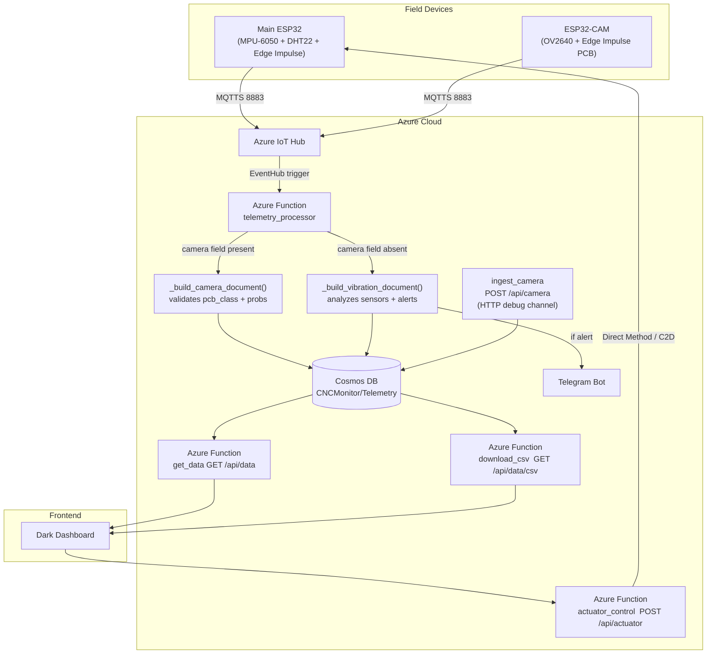
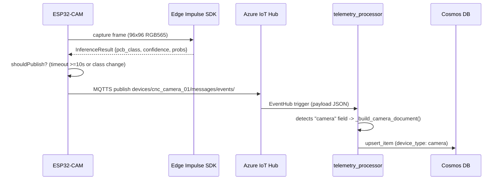
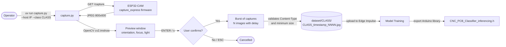

# IoT CNC PCB Monitor

IoT + Edge AI + Serverless system for analytical and preventive monitoring of a CNC milling machine used in PCB manufacturing.

More Information: [https://deivs117.github.io/IoT_CNC_Monitoring/](https://deivs117.github.io/IoT_CNC_Monitoring/)

---

## 1. Project Objective

`IoT_CNC_Monitoring` integrates embedded firmware, serverless functions in Azure, and a web dashboard to detect temperature, humidity, and vibration deviations in real time that could damage copper boards or break tools.

The system also incorporates an **independent ESP32-CAM node** with Edge AI (Edge Impulse) to automatically classify the type of PCB positioned on the CNC bed, determining the corresponding manufacturing route.

---

## 2. Architecture of the solution



> **Note:** `telemetry_processor` automatically detects the payload type: if it contains the `camera` field, it treats it as ESP32-CAM telemetry; otherwise, it processes it as telemetry from the main node (vibration/sensors). Both types coexist in the same Cosmos DB container identified by `device_id`.

---

## 3. Repository Structure

```text
IoT_CNC_Monitoring/
├── .gitignore
├── README.md
├── firmware/
│   ├── cnc_main_node/            <- Main ESP32 Node
│   │   ├── cnc_main_node.ino
│   │   ├── config.h.template
│   │   ├── edge_impulse_vibration.h
│   │   ├── sensors.h
│   │   └── ei-cnc_monitor_project-arduino-*.zip  <- Exported Edge Impulse library
│   ├── cnc_camera_node/
│   │   ├── capture_express/        <- Capture firmware for dataset
│   │   │   ├── capture_express.ino   (GET /capture -> raw JPEG)
│   │   │   └── camera_secrets.h.template
│   │   ├── dataset_capture/        <- Python automation with UV/Astral
│   │   │   ├── pyproject.toml
│   │   │   ├── uv.lock
│   │   │   ├── capture.py          (download images by class)
│   │   │   ├── README.md
│   │   │   └── dataset/            (captured images, excluded from git)
│   │   └── cnc_camera_node/        <- Edge Impulse inference firmware
│   │        ├── cnc_camera_node.ino   (classifies PCB + publishes every 10s)
│   │        └── camera_secrets.h.template
│   └── model/
│       └── dataset/
│           └── dataset_balanced.csv  <- Tabular balanced dataset from main node
├── backend/
│   ├── README.md                   <- Backend documentation
│   ├── mqtt_bridge.py            <- Mosquitto -> Azure IoT Hub bridge
│   ├── requirements.txt            <- Bridge dependencies (paho-mqtt, azure-iot-device)
│   └── azure_functions/            <- Function App Root
│       ├── host.json
│       ├── local.settings.json     <- Local variables (do not commit with real values)
│       ├── requirements.txt        <- Dependencies for Azure deployment
│       ├── shared_code/
│       │   ├── __init__.py
│       │   └── alerts.py           <- Thresholds + Telegram Bot API
│       ├── telemetry_processor/    <- IoT Hub ingestion -> Cosmos DB
│       │   ├── __init__.py
│       │   └── function.json
│       ├── get_data/             <- GET /api/data
│       │   ├── __init__.py
│       │   └── function.json
│       ├── download_csv/          <- GET /api/data/csv
│       │   ├── __init__.py
│       │   └── function.json
│       ├── actuator_control/       <- POST /api/actuator (ON/OFF/RESET)
│       │   ├── __init__.py
│       │   └── function.json
│       └── ingest_camera/        <- POST /api/camera (ESP32-CAM telemetry)
│           ├── __init__.py
│           └── function.json
├── frontend/
│   ├── README.md                   <- Frontend documentation
│   ├── index.html                <- Dark CNC PCB Dashboard
│   ├── app.js                    <- UI logic (polling, camera, actuator, CSV)
│   └── style.css                 <- Dark theme
└── Deploy/
    ├── deploy.sh                   <- Orchestrator (flags: --no-infra, --no-front, etc.)
    ├── _shared_env.sh              <- Secrets and shared variables helper
    ├── 01_infrastructure.sh        <- RG + IoT Hub + Cosmos DB Serverless + Storage Accounts
    ├── 02_backend.sh               <- Function App + App Settings + publishing
    ├── 03_frontend_hosting.sh      <- Static Website + variable injection + CORS
    ├── 04_cleanup.sh               <- Environment removal (interactive confirmation)
    ├── README.MD                   <- Deployment guide from Azure Cloud Shell
    └── infra_outputs.env.template  <- Variables template (copy to infra_outputs.env)

```

---

## 4. Telemetry JSON Contract

### Main node (cnc_fresadora_01)

Payload published by the main node via MQTTS to the topic `devices/cnc_fresadora_01/messages/events/`:

```json
{
  "device_id": "cnc_fresadora_01",
  "timestamp": 1716076800,
  "sensors": {
    "temperature": 24.5,
    "humidity": 45.2,
    "vibration_status": "normal"
  },
  "predictions": {
    "vibration_anomaly_score": 0.02,
    "visual_anomaly_score": null
  }
}

```

### ESP32-CAM node (cnc_camera_01)

Payload published by the camera node via MQTTS to the topic `devices/cnc_camera_01/messages/events/`:

```json
{
  "device_id": "cnc_camera_01",
  "timestamp": 1716076810,
  "camera": {
    "pcb_class": "PCB_SMD",
    "confidence": 0.94,
    "model_version": "1.0.0",
    "inference_ms": 312,
    "probabilities": {
      "PCB_Mixta": 0.02,
      "PCB_SMD":   0.94,
      "PCB_TH":    0.03,
      "Sin_PCB":   0.01
    }
  }
}

```

#### PCB Classification Classes

| Class | Description |
| --- | --- |
| `PCB_Mixta` | PCB with both through-hole and SMD components |
| `PCB_SMD` | PCB with surface mount components only |
| `PCB_TH` | PCB with through-hole / insertion components only |
| `Sin_PCB` | Empty bed, no visible board |

#### Controlled publishing logic (firmware)

The `cnc_camera_node.ino` firmware publishes only when:

1. **>= 10 seconds** have passed since the last publication, **or**
2. The predicted class **changed** compared to the last published inference.

This avoids saturating the IoT Hub with redundant readings and respects the free tier quota.

#### MQTT inference flow



---

## 4b. Dataset capture flow



---

## 5. Document stored in Cosmos DB

### Main node

```json
{
  "id": "cnc_fresadora_01-1716076800-a1b2c3d4",
  "device_id": "cnc_fresadora_01",
  "timestamp": 1716076800,
  "sensors": {
    "temperature": 24.5,
    "humidity": 45.2,
    "vibration_status": "normal"
  },
  "predictions": {
    "vibration_anomaly_score": 0.02,
    "visual_anomaly_score": null
  },
  "alerts": {
    "active": false,
    "reasons": [],
    "telegram_sent": false
  },
  "raw_payload": { "...": "..." }
}

```

### ESP32-CAM node

```json
{
  "id": "cnc_camera_01-1716076810-b3c4d5e6",
  "device_id": "cnc_camera_01",
  "device_type": "camera",
  "timestamp": 1716076810,
  "camera": {
    "pcb_class": "PCB_SMD",
    "confidence": 0.94,
    "model_version": "v1",
    "inference_ms": 312,
    "probabilities": {
      "PCB_Mixta": 0.02,
      "PCB_SMD":   0.94,
      "PCB_TH":    0.03,
      "Sin_PCB":   0.01
    }
  }
}

```

Both documents coexist in the same `Telemetry` container, differentiated by `device_id` (partition key).

---

## 6. Azure Functions — endpoints

| Function | Trigger | Route | Auth |
| --- | --- | --- | --- |
| `telemetry_processor` | EventHub (IoT Hub) | — | — |
| `get_data` | HTTP GET | `/api/data` | function |
| `download_csv` | HTTP GET | `/api/data/csv` | function |
| `actuator_control` | HTTP POST | `/api/actuator` | function |
| `ingest_camera` | HTTP POST | `/api/camera` | function |

### `get_data` — optional parameters

| Parameter | Type | Default | Description |
| --- | --- | --- | --- |
| `limit` | int | 100 | Maximum 500 records |
| `device_id` | string | all | Filter by device |

### `download_csv` — optional parameters

| Parameter | Type | Description |
| --- | --- | --- |
| `device_id` | string | Filter by device |

### `actuator_control` — JSON body

```json
{ "command": "ON" }

```

Valid commands: `ON`, `OFF`, `RESET`.
The `device_id` is forced from `IOT_DEVICE_ID` (environment variable), ignoring what the client sends.

---

## 7. Required environment variables

All variables are configured as App Settings in Azure (never hardcoded).
For local development, complete `backend/azure_functions/local.settings.json`.

| Variable | Description |
| --- | --- |
| `AzureWebJobsStorage` | Connection string of the Functions Storage Account |
| `FUNCTIONS_WORKER_RUNTIME` | `python` |
| `IOTHUB_EVENTS_CONNECTION_STRING` | **Event Hub-compatible endpoint** of the IoT Hub — format `Endpoint=sb://...` (for `telemetry_processor` trigger) |
| `IOT_HUB_EVENTHUB_NAME` | Internal name of the IoT Hub Event Hub |
| `IOTHUB_SERVICE_CONNECTION_STRING` | Connection string of the IoT Hub service — format `HostName=...` (for Direct Methods and C2D) |
| `IOT_DEVICE_ID` | ESP32 device ID registered in IoT Hub |
| `COSMOSDB_CONNECTION` | Primary connection string of Cosmos DB |
| `TELEGRAM_BOT_TOKEN` | Telegram bot token (from @BotFather) — optional |
| `TELEGRAM_CHAT_ID` | Telegram chat or group ID for alerts — optional |
| `ALERT_COOLDOWN_SECONDS` | Seconds between reminders of an active fault (default: `300`) |
| `TEMP_MIN` | Minimum normal temperature (default: `15.0` C) |
| `TEMP_MAX` | Maximum normal temperature (default: `45.0` C) |
| `HUM_MIN` | Minimum normal humidity (default: `20.0` %) |
| `HUM_MAX` | Maximum normal humidity (default: `80.0` %) |
| `VIBRATION_ANOMALY_THRESHOLD` | Minimum score to trigger alert (default: `0.80`) |

> **Important:** `IOTHUB_EVENTS_CONNECTION_STRING` and `IOTHUB_SERVICE_CONNECTION_STRING` are strings with **different formats**. The `01_infrastructure.sh` script obtains them automatically with the correct az CLI commands.

---

## 8. Deployment flow

### Pre-requisites

```bash
# Install az CLI and authenticate
az login

# Install Azure Functions Core Tools
npm install -g azure-functions-core-tools@4 --unsafe-perm true

```

### Telegram variables (optional — before executing)

```bash
export TELEGRAM_BOT_TOKEN="<token>"
export TELEGRAM_CHAT_ID="<chat_id>"

```

### Full deployment

```bash
cd Deploy/
./deploy.sh

```

### Partial deployments

```bash
./deploy.sh --no-infra      # Backend + frontend only (infra already exists)
./deploy.sh --no-front      # Infra + backend only
./deploy.sh --only-backend  # Republishes Functions only
./deploy.sh --only-front    # Updates frontend only

```

### Remove the environment (cost saving)

```bash
./04_cleanup.sh
# Asks for interactive confirmation before deleting.
# Use FORCE_CLEANUP=true ./04_cleanup.sh in CI/CD pipelines.

```

---

## 9. Security

* No real credentials are included in the repository. `local.settings.json` contains placeholders only.
* `Deploy/infra_outputs.env` is in `.gitignore`. Never commit this file.
* HTTP endpoints use `authLevel: "function"` to require an access key.
* The actuator `device_id` is forced from the `IOT_DEVICE_ID` environment variable.
* The `01_infrastructure.sh` script sets `chmod 600` on `infra_outputs.env`.
* Connection strings are never printed to the scripts' standard output.

---

## 10. Justification of the technological stack

This section substantiates the architectural decisions made in the project, considering constraints of reduced budget, data security, development speed, and the academic-technical context.

### Context and constraints

The PCB manufacturing process via CNC milling is high-precision. Thermal deviations or anomalous vibrations can ruin expensive copper boards and damage tools. The project operates under:

* **Extremely limited budget** (Azure student subscription)
* **Low operating cost** as a non-negotiable requirement
* **Data security** through correct credential handling
* **Development speed** suitable for an academic-technical prototype
* **Modular architecture** ready to incorporate the artificial vision layer without breaking the current design

### Architectural decision matrix

| Component | Chosen Technology | Discarded Alternatives | Justification |
| --- | --- | --- | --- |
| Firmware | C++ / Arduino IDE | MicroPython, Zephyr | Direct hardware access, library ecosystem ready for sensors, integration with Edge Impulse SDK, prototyping speed |
| Communication | MQTT (MQTTS 8883) | HTTP REST | Lower overhead for microcontrollers, pub/sub pattern decouples firmware from consumers, lower computational cost on ESP32 |
| Cloud compute | Azure Functions (Consumption Plan) | VM, Docker/ACI 24/7 | Pay for actual usage — an active VM consumes budget even when the machine is off; serverless reduces cost in academic environment; avoids persistent infrastructure management |
| Persistence | Cosmos DB Serverless | InfluxDB, PostgreSQL | Pay for usage, direct integration with Azure Functions, flexible JSON schema for coexistence of different payloads (main node + camera node), no dedicated DB management |
| Alerts | Telegram Bot API | Email SMTP, SMS | Free, simple integration via HTTP, no paid gateway dependencies, useful for immediate alerts in prototype |

### Detail by decision

#### Firmware: C++ / Arduino IDE

The Edge Impulse SDK for embedded inference exports libraries in Arduino format. Using C++ on Arduino IDE ensures direct compatibility with the exported SDK, efficient access to peripherals (I2C for MPU-6050, GPIO for DHT22, UART for debugging), and a reduced learning curve to modify the project.

#### Communication: MQTT vs. HTTP

HTTP implies a new TCP connection for each telemetry transmission, with larger headers and higher latency. MQTT maintains a persistent connection, consumes less RAM in the microcontroller, and allows multiple consumers to receive the same message without modifying the firmware (publish/subscribe pattern). Azure IoT Hub supports MQTT natively, which eliminates additional broker infrastructure.

#### Cloud compute: Azure Functions (Serverless)

A virtual machine or container active 24/7 generates cost even when the milling machine is off. In the Azure Functions Consumption Plan, the cost is proportional to the number of invocations and execution time. For a light industrial monitoring system with sampling intervals of 5 seconds, the monthly consumption falls within the free tier or near zero cost. Additionally, Azure Functions authenticates using App Settings for credentials, avoiding hardcoding.

#### Persistence: Cosmos DB Serverless

InfluxDB and PostgreSQL offer specialized functionality for time series but require dedicated instances (fixed cost). Cosmos DB in Serverless mode charges per RUs consumed, with a free tier of 1000 RUs/s. Its document data model (JSON) fits directly with the system's payloads, without the need for schema transformation. Integration with Azure Functions via connection string is native, reducing integration code.

#### Alerts: Telegram Bot API

Email (SendGrid, SMTP) and SMS (Twilio) solutions have variable costs per message or require verification of domains. The Telegram API is free, requires no additional infrastructure, and integration is reduced to an HTTP POST with the bot token, which accelerates prototype validation.

---

## 11. Project status and extensibility

### Ready for production

* Complete pipeline: ESP32 -> MQTT -> IoT Hub -> Cosmos DB -> Dashboard
* Independent ESP32-CAM node: MQTTS -> IoT Hub -> `telemetry_processor` -> Cosmos DB (main route) or HTTP POST -> `ingest_camera` -> Cosmos DB (debug route)
* Real-time PCB classification: `PCB_Mixta`, `PCB_SMD`, `PCB_TH`, `Sin_PCB`
* Controlled camera publishing: every 10 s or upon class change
* Actuator control (3 cascading methods: Direct Method, C2D SDK, REST C2D)
* Telegram alerts with anti-spam policy (configurable cooldown)
* Repeatable deployment scripts with a single command

### ESP32-CAM flow — first steps

1. **Register the cnc_camera_01 device in IoT Hub:**
```bash
az iot hub device-identity create \
  --hub-name <hub-name> --device-id cnc_camera_01
# Get the primary key for camera_secrets.h:
az iot hub device-identity show \
  --hub-name <hub-name> --device-id cnc_camera_01 \
  --query "authentication.symmetricKey.primaryKey" --output tsv

```


2. **Dataset capture**: load `firmware/cnc_camera_node/capture_express/capture_express.ino`, then execute:
```bash
cd firmware/cnc_camera_node/dataset_capture
uv run capture.py --host 192.168.1.100 --class PCB_SMD --count 50
# For environments without a screen: add --no-preview

```


3. **Train model**: upload images to Edge Impulse Studio and export the Arduino library.
4. **Compile MQTT inference firmware**: copy `camera_secrets.h.template` -> `camera_secrets.h`, fill in `WIFI_SSID`, `WIFI_PASS`, `IOT_HUB_HOST` and `DEVICE_PRIMARY_KEY`. Install `PubSubClient` via Library Manager. Compile and load `cnc_camera_node.ino`.

### Future extensions

* **New alerts**: add conditions in `shared_code/alerts.py` without touching other functions.
* **Cosmos DB indexes**: to accelerate queries ordered by `timestamp`, add a composite index policy `["/device_id ASC", "/timestamp DESC"]` in the `Telemetry` container.
* **Frontend on Vercel**: see `frontend/README.md` for Vercel and GitHub Pages deployment instructions.
* **Tabular dataset**: `firmware/model/dataset/dataset_balanced.csv` contains the balanced dataset from the main node for training or evaluation outside Edge Impulse.
