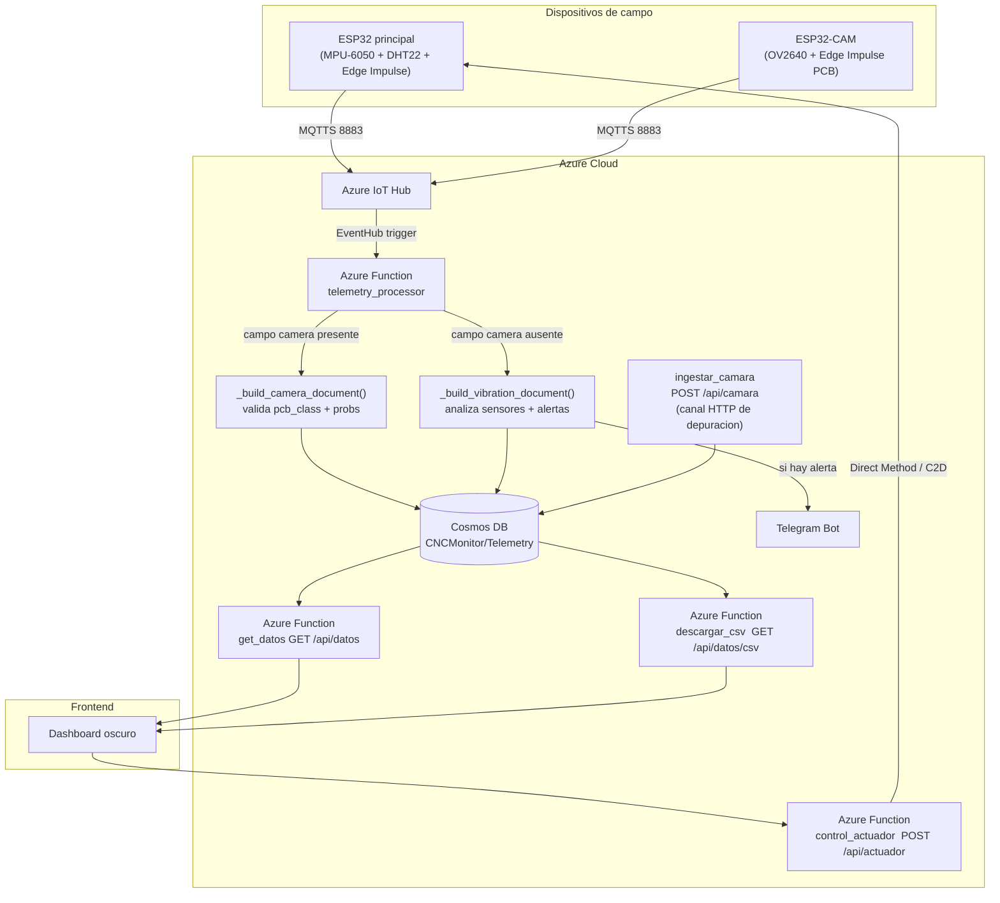
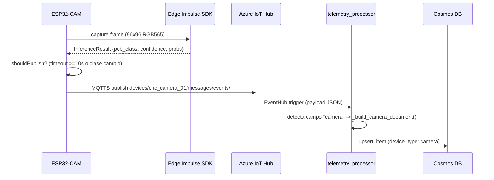
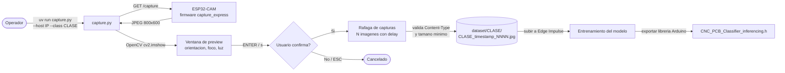

# IoT CNC PCB Monitor

Sistema IoT + Edge AI + Serverless para monitoreo analitico y preventivo de una fresadora CNC usada en manufactura de PCBs.

Sustentable: https://deivs117.github.io/IoT_CNC_Monitoring/

---

## 1. Objetivo del proyecto

`IoT_CNC_Monitoring` integra firmware embebido, funciones serverless en Azure y un dashboard web para detectar en tiempo real desviaciones de temperatura, humedad y vibracion que puedan danar placas de cobre o romper herramientas.

El sistema incorpora ademas un **nodo ESP32-CAM independiente** con vision artificial Edge AI (Edge Impulse) para clasificar automaticamente el tipo de PCB posicionada en la bancada de la CNC, determinando la ruta de manufactura correspondiente.

---

## 2. Arquitectura de la solucion



> **Nota:** `telemetry_processor` detecta automaticamente el tipo de payload: si contiene el campo `camera` lo trata como telemetria de la ESP32-CAM; de lo contrario lo procesa como telemetria del nodo principal (vibracion/sensores). Ambos tipos coexisten en el mismo contenedor Cosmos DB identificados por `device_id`.

---

## 3. Estructura del repositorio

```text
IoT_CNC_Monitoring/
├── .gitignore
├── README.md
├── firmware/
│   ├── cnc_main_node/              <- Nodo principal ESP32
│   │   ├── cnc_main_node.ino
│   │   ├── config.h.template
│   │   ├── edge_impulse_vibration.h
│   │   ├── sensors.h
│   │   └── ei-cnc_monitor_project-arduino-*.zip  <- libreria Edge Impulse exportada
│   ├── cnc_camera_node/
│   │   ├── capture_express/        <- Firmware de captura para dataset
│   │   │   ├── capture_express.ino   (GET /capture -> JPEG crudo)
│   │   │   └── camera_secrets.h.template
│   │   ├── dataset_capture/        <- Automatizacion Python con UV/Astral
│   │   │   ├── pyproject.toml
│   │   │   ├── uv.lock
│   │   │   ├── capture.py          (descarga imagenes por clase)
│   │   │   ├── README.md
│   │   │   └── dataset/            (imagenes capturadas, excluidas de git)
│   │   └── cnc_camera_node/        <- Firmware de inferencia Edge Impulse
│   │       ├── cnc_camera_node.ino   (clasifica PCB + publica cada 10s)
│   │       └── camera_secrets.h.template
│   └── model/
│       └── dataset/
│           └── dataset_balanced.csv  <- Dataset tabular balanceado del nodo principal
├── backend/
│   ├── README.md                   <- Documentacion del backend
│   ├── mqtt_bridge.py              <- Puente Mosquitto -> Azure IoT Hub
│   ├── requirements.txt            <- Dependencias del bridge (paho-mqtt, azure-iot-device)
│   └── azure_functions/            <- Raiz del Function App
│       ├── host.json
│       ├── local.settings.json     <- Variables locales (no commitear con valores reales)
│       ├── requirements.txt        <- Dependencias para despliegue en Azure
│       ├── shared_code/
│       │   ├── __init__.py
│       │   └── alerts.py           <- Umbrales + Telegram Bot API
│       ├── telemetry_processor/    <- Ingestión IoT Hub -> Cosmos DB
│       │   ├── __init__.py
│       │   └── function.json
│       ├── get_datos/              <- GET /api/datos
│       │   ├── __init__.py
│       │   └── function.json
│       ├── descargar_csv/          <- GET /api/datos/csv
│       │   ├── __init__.py
│       │   └── function.json
│       ├── control_actuador/       <- POST /api/actuador (ON/OFF/RESET)
│       │   ├── __init__.py
│       │   └── function.json
│       └── ingestar_camara/        <- POST /api/camara (telemetria ESP32-CAM)
│           ├── __init__.py
│           └── function.json
├── frontend/
│   ├── README.md                   <- Documentacion del frontend
│   ├── index.html                  <- Dashboard oscuro CNC PCB
│   ├── app.js                      <- Logica de UI (polling, camara, actuador, CSV)
│   └── style.css                   <- Tema oscuro
└── Deploy/
    ├── deploy.sh                   <- Orquestador (flags: --no-infra, --no-front, etc.)
    ├── _shared_env.sh              <- Helper de secretos y variables compartidas
    ├── 01_infraestructura.sh       <- RG + IoT Hub + Cosmos DB Serverless + Storage Accounts
    ├── 02_backend.sh               <- Function App + App Settings + publicacion
    ├── 03_frontend_hosting.sh      <- Static Website + inyeccion de variables + CORS
    ├── 04_cleanup.sh               <- Eliminacion del entorno (confirmacion interactiva)
    ├── README.MD                   <- Guia de despliegue desde Azure Cloud Shell
    └── infra_outputs.env.template  <- Plantilla de variables (copiar a infra_outputs.env)
```

---

## 4. Contrato JSON de telemetria

### Nodo principal (cnc_fresadora_01)

Payload publicado por el nodo principal via MQTTS al topic `devices/cnc_fresadora_01/messages/events/`:

```json
{
  "device_id": "cnc_fresadora_01",
  "timestamp": 1716076800,
  "sensors": {
    "temperature": 24.5,
    "humidity": 45.2,
    "vibration_status": "normal"
  },
  "predictions": {
    "vibration_anomaly_score": 0.02,
    "visual_anomaly_score": null
  }
}
```

### Nodo ESP32-CAM (cnc_camera_01)

Payload publicado por el nodo de camara via MQTTS al topic `devices/cnc_camera_01/messages/events/`:

```json
{
  "device_id": "cnc_camera_01",
  "timestamp": 1716076810,
  "camera": {
    "pcb_class": "PCB_SMD",
    "confidence": 0.94,
    "model_version": "1.0.0",
    "inference_ms": 312,
    "probabilities": {
      "PCB_Mixta": 0.02,
      "PCB_SMD":   0.94,
      "PCB_TH":    0.03,
      "Sin_PCB":   0.01
    }
  }
}
```

#### Clases de clasificacion PCB

| Clase | Descripcion |
|---|---|
| `PCB_Mixta` | PCB con componentes through-hole y SMD coexistiendo |
| `PCB_SMD`   | PCB con componentes de montaje superficial unicamente |
| `PCB_TH`    | PCB con componentes through-hole / insercion unicamente |
| `Sin_PCB`   | Bancada vacia, sin placa visible |

#### Logica de publicacion controlada (firmware)

El firmware `cnc_camera_node.ino` publica unicamente cuando:
1. Han transcurrido **>= 10 segundos** desde la ultima publicacion, **o**
2. La clase predicha **cambio** respecto a la ultima inferencia publicada.

Esto evita saturar el IoT Hub con lecturas redundantes y respeta la cuota del tier gratuito.

#### Flujo de inferencia MQTT



---

## 4b. Flujo de captura del dataset



---

## 5. Documento almacenado en Cosmos DB

### Nodo principal

```json
{
  "id": "cnc_fresadora_01-1716076800-a1b2c3d4",
  "device_id": "cnc_fresadora_01",
  "timestamp": 1716076800,
  "sensors": {
    "temperature": 24.5,
    "humidity": 45.2,
    "vibration_status": "normal"
  },
  "predictions": {
    "vibration_anomaly_score": 0.02,
    "visual_anomaly_score": null
  },
  "alerts": {
    "active": false,
    "reasons": [],
    "telegram_sent": false
  },
  "raw_payload": { "...": "..." }
}
```

### Nodo ESP32-CAM

```json
{
  "id": "cnc_camera_01-1716076810-b3c4d5e6",
  "device_id": "cnc_camera_01",
  "device_type": "camera",
  "timestamp": 1716076810,
  "camera": {
    "pcb_class": "PCB_SMD",
    "confidence": 0.94,
    "model_version": "v1",
    "inference_ms": 312,
    "probabilities": {
      "PCB_Mixta": 0.02,
      "PCB_SMD":   0.94,
      "PCB_TH":    0.03,
      "Sin_PCB":   0.01
    }
  }
}
```

Ambos documentos coexisten en el mismo contenedor `Telemetry`, diferenciados por `device_id` (partition key).

---

## 6. Azure Functions — endpoints

| Funcion | Trigger | Ruta | Auth |
|---|---|---|---|
| `telemetry_processor` | EventHub (IoT Hub) | — | — |
| `get_datos` | HTTP GET | `/api/datos` | function |
| `descargar_csv` | HTTP GET | `/api/datos/csv` | function |
| `control_actuador` | HTTP POST | `/api/actuador` | function |
| `ingestar_camara` | HTTP POST | `/api/camara` | function |

### `get_datos` — parametros opcionales
| Parametro | Tipo | Default | Descripcion |
|---|---|---|---|
| `limit` | int | 100 | Maximo 500 registros |
| `device_id` | string | todos | Filtrar por dispositivo |

### `descargar_csv` — parametros opcionales
| Parametro | Tipo | Descripcion |
|---|---|---|
| `device_id` | string | Filtrar por dispositivo |

### `control_actuador` — body JSON
```json
{ "comando": "ON" }
```
Comandos validos: `ON`, `OFF`, `RESET`.
El `device_id` se fuerza desde `IOT_DEVICE_ID` (variable de entorno), ignorando lo que envie el cliente.

---

## 7. Variables de entorno requeridas

Todas las variables se configuran como App Settings en Azure (nunca hardcodeadas).
Para desarrollo local, completar `backend/azure_functions/local.settings.json`.

| Variable | Descripcion |
|---|---|
| `AzureWebJobsStorage` | Cadena de conexion del Storage Account de Functions |
| `FUNCTIONS_WORKER_RUNTIME` | `python` |
| `IOTHUB_EVENTS_CONNECTION_STRING` | **Endpoint Event Hub-compatible** del IoT Hub — formato `Endpoint=sb://...` (para el trigger de `telemetry_processor`) |
| `IOT_HUB_EVENTHUB_NAME` | Nombre interno del Event Hub del IoT Hub |
| `IOTHUB_SERVICE_CONNECTION_STRING` | Cadena de conexion del servicio IoT Hub — formato `HostName=...` (para Direct Methods y C2D) |
| `IOT_DEVICE_ID` | ID del dispositivo ESP32 registrado en IoT Hub |
| `COSMOSDB_CONNECTION` | Cadena de conexion primaria de Cosmos DB |
| `TELEGRAM_BOT_TOKEN` | Token del bot de Telegram (de @BotFather) — opcional |
| `TELEGRAM_CHAT_ID` | ID del chat o grupo de Telegram para alertas — opcional |
| `ALERT_COOLDOWN_SECONDS` | Segundos entre recordatorios de fallo activo (default: `300`) |
| `TEMP_MIN` | Temperatura minima normal (default: `15.0` grados C) |
| `TEMP_MAX` | Temperatura maxima normal (default: `45.0` grados C) |
| `HUM_MIN` | Humedad minima normal (default: `20.0` %) |
| `HUM_MAX` | Humedad maxima normal (default: `80.0` %) |
| `VIBRATION_ANOMALY_THRESHOLD` | Score minimo para disparar alerta (default: `0.80`) |

> **Importante:** `IOTHUB_EVENTS_CONNECTION_STRING` e `IOTHUB_SERVICE_CONNECTION_STRING` son cadenas con **formatos distintos**. El script `01_infraestructura.sh` las obtiene automaticamente con los comandos correctos del az CLI.

---

## 8. Flujo de despliegue

### Pre-requisitos

```bash
# Instalar az CLI y autenticarse
az login

# Instalar Azure Functions Core Tools
npm install -g azure-functions-core-tools@4 --unsafe-perm true
```

### Variables de Telegram (opcionales — antes de ejecutar)

```bash
export TELEGRAM_BOT_TOKEN="<token>"
export TELEGRAM_CHAT_ID="<chat_id>"
```

### Despliegue completo

```bash
cd Deploy/
./deploy.sh
```

### Despliegues parciales

```bash
./deploy.sh --no-infra      # Solo backend + frontend (infra ya existe)
./deploy.sh --no-front      # Solo infra + backend
./deploy.sh --only-backend  # Solo republica las Functions
./deploy.sh --only-front    # Solo actualiza el frontend
```

### Eliminar el entorno (ahorro de costos)

```bash
./04_cleanup.sh
# Pide confirmacion interactiva antes de borrar.
# Usar FORCE_CLEANUP=true ./04_cleanup.sh en pipelines CI/CD.
```

---

## 9. Seguridad

- Ninguna credencial real se incluye en el repositorio. `local.settings.json` contiene unicamente placeholders.
- `Deploy/infra_outputs.env` esta en `.gitignore`. Nunca commitear este archivo.
- Los endpoints HTTP usan `authLevel: "function"` para requerir una clave de acceso.
- El `device_id` del actuador se fuerza desde la variable de entorno `IOT_DEVICE_ID`.
- El script `01_infraestructura.sh` establece `chmod 600` en `infra_outputs.env`.
- Las cadenas de conexion nunca se imprimen en la salida estandar de los scripts.

---

## 10. Justificacion del stack tecnologico

Esta seccion fundamenta las decisiones de arquitectura tomadas en el proyecto, considerando las restricciones de presupuesto reducido, seguridad de datos, velocidad de desarrollo y el contexto academico-tecnico.

### Contexto y restricciones

El proceso de manufactura de PCBs mediante fresado CNC es de alta precision. Desviaciones termicas o vibraciones anomalas pueden arruinar placas de cobre costosas y danar herramientas. El proyecto opera bajo:

- **Presupuesto extremadamente limitado** (suscripcion de estudiante de Azure)
- **Bajo costo operativo** como requisito no negociable
- **Seguridad de datos** mediante manejo correcto de credenciales
- **Velocidad de desarrollo** adecuada para prototipo academico-tecnico
- **Arquitectura modular** preparada para incorporar la capa de vision artificial sin romper el diseno actual

### Matriz de decisiones arquitectonicas

| Componente | Tecnologia elegida | Alternativas descartadas | Justificacion |
|---|---|---|---|
| Firmware | C++ / Arduino IDE | MicroPython, Zephyr | Acceso directo al hardware, ecosistema de librerias listo para sensores, integracion con Edge Impulse SDK, velocidad de prototipado |
| Comunicacion | MQTT (MQTTS 8883) | HTTP REST | Menor overhead para microcontroladores, patron pub/sub desacopla firmware de consumidores, menor costo computacional en ESP32 |
| Computo cloud | Azure Functions (Consumption Plan) | VM, Docker/ACI 24/7 | Pago por uso real — una VM activa consume presupuesto aunque la maquina este apagada; serverless reduce costo en entorno academico; evita administracion de infraestructura persistente |
| Persistencia | Cosmos DB Serverless | InfluxDB, PostgreSQL | Pago por uso, integracion directa con Azure Functions, esquema JSON flexible para coexistencia de payloads distintos (nodo principal + nodo camara), sin administracion de BD dedicada |
| Alertas | Telegram Bot API | Correo SMTP, SMS | Gratuito, integracion simple via HTTP, sin dependencias de pasarelas pagas, util para alertas inmediatas en prototipo |

### Detalle por decision

#### Firmware: C++ / Arduino IDE

El SDK de Edge Impulse para inferencia embebida exporta librerias en formato Arduino. Usar C++ sobre Arduino IDE garantiza compatibilidad directa con el SDK exportado, acceso eficiente a los perifericos (I2C para MPU-6050, GPIO para DHT22, UART para depuracion), y una curva de aprendizaje reducida para modificar el proyecto.

#### Comunicacion: MQTT frente a HTTP

HTTP implica una conexion TCP nueva por cada envio de telemetria, con headers de mayor tamano y mayor latencia. MQTT mantiene una conexion persistente, consume menos memoria RAM en el microcontrolador y permite que multiples consumidores reciban el mismo mensaje sin modificar el firmware (patron publish/subscribe). Azure IoT Hub soporta MQTT nativamente, lo que elimina infraestructura adicional de broker.

#### Computo cloud: Azure Functions (Serverless)

Una maquina virtual o contenedor activo 24/7 genera costo incluso cuando la fresadora esta apagada. En el Consumption Plan de Azure Functions, el costo es proporcional al numero de invocaciones y al tiempo de ejecucion. Para un sistema de monitoreo industrial ligero con intervalos de muestreo de 5 segundos, el consumo mensual cae dentro del tier gratuito o cerca de cero costo. Adicionalmente, Azure Functions se autentica mediante App Settings para credenciales, evitando hardcodeo.

#### Persistencia: Cosmos DB Serverless

InfluxDB y PostgreSQL ofrecen funcionalidades especializadas en series temporales, pero requieren instancias dedicadas (costo fijo). Cosmos DB en modo Serverless cobra por RUs consumidas, con un tier gratuito de 1000 RUs/s. Su modelo de datos documental (JSON) encaja directamente con los payloads del sistema, sin necesidad de transformacion de esquema. La integracion con Azure Functions via cadena de conexion es nativa, reduciendo codigo de integracion.

#### Alertas: Telegram Bot API

Las soluciones de correo (SendGrid, SMTP) y SMS (Twilio) tienen costos variables por mensaje o requieren configuracion de dominios verificados. La API de Telegram es gratuita, no requiere infraestructura adicional, y la integracion se reduce a un POST HTTP con el token del bot, lo que acelera la validacion del prototipo.

---

## 11. Estado del proyecto y extensibilidad

### Listo para produccion
- Pipeline completo: ESP32 -> MQTT -> IoT Hub -> Cosmos DB -> Dashboard
- Nodo ESP32-CAM independiente: MQTTS -> IoT Hub -> `telemetry_processor` -> Cosmos DB (ruta principal) o HTTP POST -> `ingestar_camara` -> Cosmos DB (ruta de depuracion)
- Clasificacion PCB en tiempo real: `PCB_Mixta`, `PCB_SMD`, `PCB_TH`, `Sin_PCB`
- Publicacion controlada de camara: cada 10 s o ante cambio de clase
- Control de actuador (3 metodos en cascada: Direct Method, C2D SDK, REST C2D)
- Alertas de Telegram con politica anti-spam (cooldown configurable)
- Scripts de despliegue repetibles con un solo comando

### Flujo ESP32-CAM — primeros pasos

1. **Registrar el dispositivo cnc_camera_01 en IoT Hub:**
   ```bash
   az iot hub device-identity create \
     --hub-name <hub-name> --device-id cnc_camera_01
   # Obtener la clave primaria para camera_secrets.h:
   az iot hub device-identity show \
     --hub-name <hub-name> --device-id cnc_camera_01 \
     --query "authentication.symmetricKey.primaryKey" --output tsv
   ```
2. **Captura del dataset**: cargar `firmware/cnc_camera_node/capture_express/capture_express.ino`, luego ejecutar:
   ```bash
   cd firmware/cnc_camera_node/dataset_capture
   uv run capture.py --host 192.168.1.100 --class PCB_SMD --count 50
   # Para entornos sin pantalla: anadir --no-preview
   ```
3. **Entrenar modelo**: subir imagenes a Edge Impulse Studio y exportar la libreria Arduino.
4. **Compilar firmware de inferencia MQTT**: copiar `camera_secrets.h.template` -> `camera_secrets.h`, rellenar `WIFI_SSID`, `WIFI_PASS`, `IOT_HUB_HOST` y `DEVICE_PRIMARY_KEY`. Instalar `PubSubClient` via Library Manager. Compilar y cargar `cnc_camera_node.ino`.

### Futuras extensiones
- **Nuevas alertas**: agregar condiciones en `shared_code/alerts.py` sin tocar las demas funciones.
- **Indices Cosmos DB**: para acelerar las consultas ordenadas por `timestamp`, agregar una politica de indice compuesto `["/device_id ASC", "/timestamp DESC"]` en el contenedor `Telemetry`.
- **Frontend en Vercel**: ver `frontend/README.md` para instrucciones de despliegue en Vercel y GitHub Pages.
- **Dataset tabular**: `firmware/model/dataset/dataset_balanced.csv` contiene el dataset balanceado del nodo principal para entrenamiento o evaluacion fuera de Edge Impulse.
