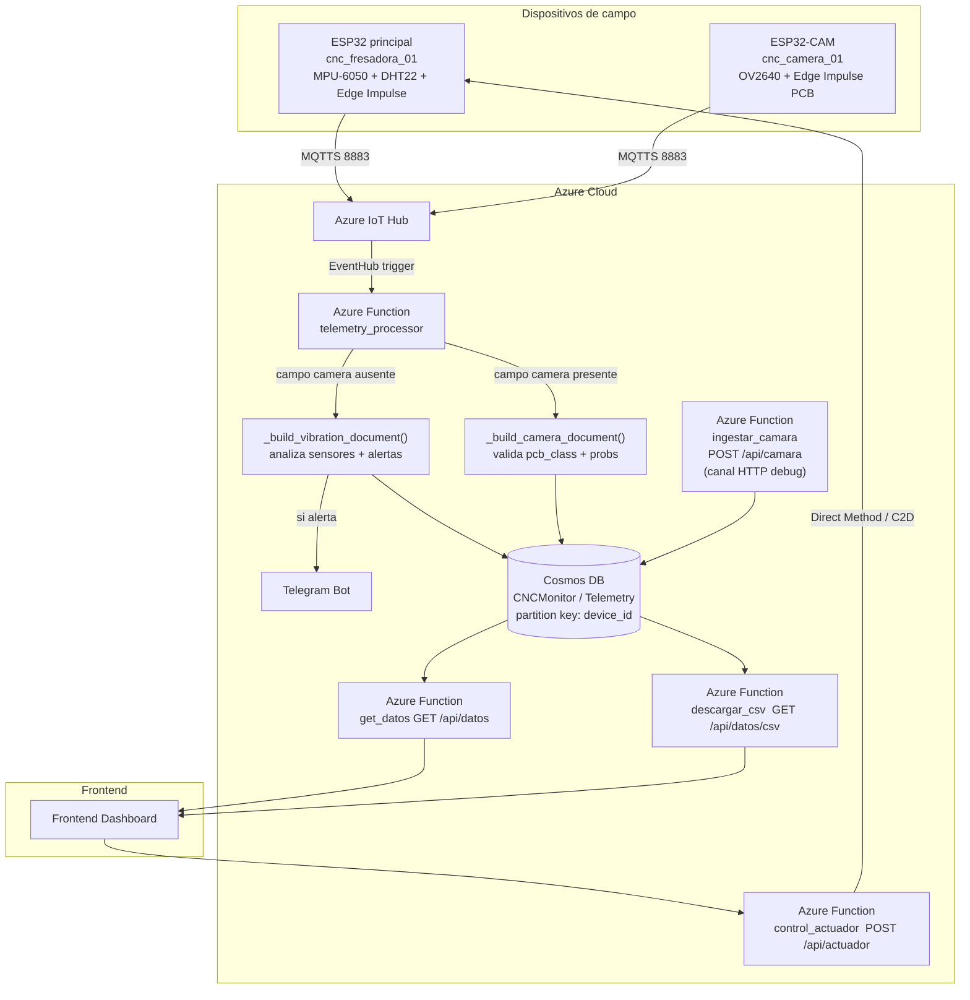

# Backend — CNC PCB IoT Monitoring

## Arquitectura



> **Nota:** `telemetry_processor` detecta el tipo de payload por la presencia del campo `camera`. Ambos tipos coexisten en el mismo contenedor Cosmos DB identificados por `device_id` y `device_type`.

---

## Estructura de carpetas

```
backend/
├── mqtt_bridge.py                        # Puente Mosquitto -> Azure IoT Hub
├── requirements.txt                      # Dependencias del bridge: paho-mqtt, azure-iot-device
└── azure_functions/                      # Raiz del Function App (desplegar con func CLI)
    ├── host.json                         # Configuracion del runtime (extensionBundle 4.x)
    ├── local.settings.json               # Variables de entorno LOCALES — NO commitear
    ├── requirements.txt                  # Dependencias de las Functions para despliegue
    ├── shared_code/
    │   ├── __init__.py
    │   └── alerts.py                     # Umbrales de alerta + notificaciones Telegram
    ├── telemetry_processor/
    │   ├── __init__.py                   # EventHub Trigger -> evalua alertas -> Cosmos DB
    │   └── function.json                 # Trigger: EventHub | Output Binding: Cosmos DB
    ├── get_datos/
    │   ├── __init__.py                   # GET /api/datos -> ultimas N lecturas de Cosmos DB
    │   └── function.json                 # HTTP GET, authLevel: function, route: datos
    ├── descargar_csv/
    │   ├── __init__.py                   # GET /api/datos/csv -> CSV descargable
    │   └── function.json                 # HTTP GET, authLevel: function, route: datos/csv
    ├── control_actuador/
    │   ├── __init__.py                   # POST /api/actuador -> Direct Method / C2D al ESP32
    │   └── function.json                 # HTTP POST, authLevel: function, route: actuador
    └── ingestar_camara/
        ├── __init__.py                   # POST /api/camara -> persiste telemetria ESP32-CAM
        └── function.json                 # HTTP POST, authLevel: function, route: camara
```

---

## Recursos Azure necesarios

| Recurso | Nombre por defecto | Proposito |
|---|---|---|
| Resource Group | `rg-cnc-iot` | Contenedor de todos los recursos |
| IoT Hub | `cnc-iot-hub` | Ingesta de mensajes del ESP32 |
| Cosmos DB (Serverless) | `cnc-iot-cosmos` | Almacen de telemetria |
| Storage Account (Functions) | `cnciotfunc<hash>` | AzureWebJobsStorage |
| Function App | `cnc-iot-func` | Runtime de las Azure Functions |
| Storage Account (Frontend) | `cnciotfront<hash>` | Static Website (opcional) |

> Los nombres por defecto se configuran en `01_infraestructura.sh` y pueden sobreescribirse con variables de entorno antes de ejecutar.

### Cosmos DB
- **Base de datos:** `CNCMonitor`
- **Contenedor:** `Telemetry`
- **Partition key:** `/device_id`

### Dispositivos IoT Hub

| Device ID | Firmware | Descripcion |
|---|---|---|
| `cnc_fresadora_01` | `firmware/cnc_main_node/cnc_main_node.ino` | Nodo principal (sensores + vibracion) |
| `cnc_camera_01`   | `firmware/cnc_camera_node/cnc_camera_node/cnc_camera_node.ino` | Nodo camara (clasificacion PCB) |

Ambos dispositivos deben registrarse en IoT Hub antes de cargar el firmware. Ver `Deploy/01_infraestructura.sh` o ejecutar:
```bash
az iot hub device-identity create --hub-name <hub-name> --device-id cnc_fresadora_01
az iot hub device-identity create --hub-name <hub-name> --device-id cnc_camera_01
```

---

## Variables de entorno

Para desarrollo local, copiar la plantilla y rellenar valores reales en
`backend/azure_functions/local.settings.json` (nunca commitear con valores reales — esta en `.gitignore`).

```json
{
  "IsEncrypted": false,
  "Values": {
    "AzureWebJobsStorage": "UseDevelopmentStorage=true",
    "FUNCTIONS_WORKER_RUNTIME": "python",
    "IOTHUB_EVENTS_CONNECTION_STRING": "Endpoint=sb://<namespace>.servicebus.windows.net/;...",
    "IOT_HUB_EVENTHUB_NAME": "iothub-ehub-<hub>-<id>",
    "IOTHUB_SERVICE_CONNECTION_STRING": "HostName=<hub>.azure-devices.net;SharedAccessKeyName=service;SharedAccessKey=...",
    "IOT_DEVICE_ID": "cnc_fresadora_01",
    "COSMOSDB_CONNECTION": "AccountEndpoint=https://<account>.documents.azure.com:443/;AccountKey=...;",
    "TELEGRAM_BOT_TOKEN": "",
    "TELEGRAM_CHAT_ID": "",
    "ALERT_COOLDOWN_SECONDS": "300",
    "TEMP_MIN": "15.0",
    "TEMP_MAX": "45.0",
    "HUM_MIN": "20.0",
    "HUM_MAX": "80.0",
    "VIBRATION_ANOMALY_THRESHOLD": "0.80"
  }
}
```

### Descripcion de cada variable

| Variable | Descripcion | Donde obtenerla |
|---|---|---|
| `AzureWebJobsStorage` | Cadena de conexion del Storage de Functions | Portal -> Storage Account -> Claves de acceso |
| `FUNCTIONS_WORKER_RUNTIME` | Siempre `python` | — |
| `IOTHUB_EVENTS_CONNECTION_STRING` | Endpoint Event Hub-compatible del IoT Hub (para el trigger de `telemetry_processor`) | Portal -> IoT Hub -> Endpoints integrados -> **Punto de conexion compatible con Event Hubs**. Formato: `Endpoint=sb://...` |
| `IOT_HUB_EVENTHUB_NAME` | Nombre corto del Event Hub interno | Misma pantalla -> **Nombre compatible con Event Hubs** |
| `IOTHUB_SERVICE_CONNECTION_STRING` | Cadena de conexion del servicio IoT Hub (para Direct Methods y C2D) | Portal -> IoT Hub -> Directivas de acceso compartido -> **service** -> Cadena de conexion principal. Formato: `HostName=...` |
| `IOT_DEVICE_ID` | ID del dispositivo ESP32 registrado | `cnc_fresadora_01` |
| `COSMOSDB_CONNECTION` | Cadena de conexion primaria de Cosmos DB | Portal -> Cosmos DB -> Claves -> Cadena de conexion principal |
| `TELEGRAM_BOT_TOKEN` | Token del bot de alertas (de `@BotFather`) | Telegram -> `@BotFather` -> `/newbot` |
| `TELEGRAM_CHAT_ID` | ID del chat que recibe alertas | `https://api.telegram.org/bot<TOKEN>/getUpdates` -> campo `chat.id` |
| `ALERT_COOLDOWN_SECONDS` | Segundos entre recordatorios de fallo activo | Default: `300` (5 minutos) |
| `TEMP_MIN` / `TEMP_MAX` | Rango de temperatura normal (grados C) | Default: `15.0` / `45.0` |
| `HUM_MIN` / `HUM_MAX` | Rango de humedad normal (%) | Default: `20.0` / `80.0` |
| `VIBRATION_ANOMALY_THRESHOLD` | Score minimo para disparar alerta vibracional | Default: `0.80` |

> **Importante:** `IOTHUB_EVENTS_CONNECTION_STRING` e `IOTHUB_SERVICE_CONNECTION_STRING` son cadenas distintas con formatos distintos. El script `01_infraestructura.sh` las obtiene automaticamente con los comandos correctos de `az CLI`.

---

## Endpoints de la API

La URL base del Function App se obtiene al ejecutar `02_backend.sh` y queda guardada en `Deploy/infra_outputs.env` como `FUNC_BASE_URL`.

Todos los endpoints requieren la clave de funcion como query param `?code=<key>`.

| Endpoint | Metodo | Descripcion |
|---|---|---|
| `/api/datos` | GET | Ultimas 100 lecturas (ajustable con `?limit=N`, max 500) |
| `/api/datos` | GET | Filtrar por dispositivo con `?device_id=cnc_fresadora_01` |
| `/api/datos/csv` | GET | Descarga CSV completo (filtrable con `?device_id=...`) |
| `/api/actuador` | POST | Envia comando al ESP32 — body: `{"comando": "ON|OFF|RESET"}` |
| `/api/camara` | POST | Persiste telemetria de la ESP32-CAM (canal HTTP alternativo) |

---

## Logica de cada Azure Function

### `telemetry_processor`

- **Trigger:** EventHub (IoT Hub, endpoint compatible con Event Hubs)
- **Salida:** upsert en Cosmos DB (`CNCMonitor/Telemetry`)
- Detecta el tipo de payload por la presencia del campo `camera`:
  - Con campo `camera`: llama a `_build_camera_document()` — normaliza las 4 clases PCB y almacena `device_type: "camera"`
  - Sin campo `camera`: llama a `_build_vibration_document()` — evalua umbrales de temperatura, humedad y score vibracional, dispara alertas Telegram si corresponde
- Implementa politica anti-spam via `maybe_send_telegram_alert()` con cooldown configurable

### `get_datos`

- **Trigger:** HTTP GET `/api/datos`
- Consulta Cosmos DB con limite configurable (1-500, default 100), ordenado por `timestamp DESC`
- Soporta filtro opcional por `device_id`
- Devuelve JSON con el array de documentos

### `descargar_csv`

- **Trigger:** HTTP GET `/api/datos/csv`
- Exporta todos los registros del contenedor `Telemetry` en formato CSV
- Soporta filtro opcional por `device_id`
- Devuelve respuesta con `Content-Disposition: attachment; filename=telemetria.csv`

### `control_actuador`

- **Trigger:** HTTP POST `/api/actuador`
- Recibe `{"comando": "ON|OFF|RESET"}` y envia la instruccion al ESP32 mediante 3 metodos en cascada:
  1. **Direct Method** via `azure-iot-hub` SDK — preferido, confirmacion en tiempo real
  2. **C2D SDK** via `azure-iot-hub` SDK — fallback cuando el dispositivo esta offline
  3. **REST HTTP C2D** con token SAS manual — ultimo recurso si el SDK falla
- El `device_id` se fuerza siempre desde `IOT_DEVICE_ID` para evitar inyeccion de identificadores arbitrarios

### `ingestar_camara`

- **Trigger:** HTTP POST `/api/camara`
- Canal alternativo HTTP para recibir telemetria de la ESP32-CAM (util para depuracion o cuando el dispositivo no usa MQTTS)
- Valida que el payload incluya `camera.pcb_class` con un valor valido
- Construye y persiste el mismo esquema de documento que `telemetry_processor` para payloads de camara
- El GET `/api/datos` puede filtrar estos registros por `device_id=cnc_camera_01` sin modificacion adicional

### `shared_code/alerts.py`

- Modulo compartido importado por `telemetry_processor`
- Define umbrales de temperatura, humedad y score vibracional leidos desde variables de entorno
- `evaluate_alert()` retorna la lista de razones de alerta para un conjunto de lecturas
- `maybe_send_telegram_alert()` implementa la politica anti-spam con cooldown en memoria, protegida por lock para ejecucion concurrente

---

## MQTT Bridge (`mqtt_bridge.py`)

Script Python que corre localmente junto con Mosquitto. Actua como puente entre el ESP32 (MQTT sin TLS) y Azure IoT Hub (MQTT con TLS), evitando la necesidad de TLS directo en el microcontrolador.

### Instalacion de dependencias

```bash
pip install -r backend/requirements.txt
# Instala: paho-mqtt, azure-iot-device
```

### Variables de entorno

```bash
# Linux/macOS
export DEVICE_CONN_STR="HostName=<hub>.azure-devices.net;DeviceId=cnc_fresadora_01;SharedAccessKey=<key>"

# Windows PowerShell
$env:DEVICE_CONN_STR = "HostName=<hub>.azure-devices.net;DeviceId=cnc_fresadora_01;SharedAccessKey=<key>"
```

Obtener `DEVICE_CONN_STR`:
Portal Azure -> IoT Hub -> Administracion de dispositivos -> `cnc_fresadora_01` -> **Cadena de conexion principal**

### Ejecucion

```bash
# 1. Arrancar Mosquitto (Windows)
& "C:\Program Files\mosquitto\mosquitto.exe" -c mosquitto.conf -v

# 2. Correr el bridge
python backend/mqtt_bridge.py
```

> El MQTT bridge es un componente de integracion opcional. En el flujo de produccion, el firmware del ESP32 se conecta directamente al IoT Hub via MQTTS (puerto 8883) sin necesidad del bridge.

---

## Despliegue del backend

El despliegue automatizado se realiza con los scripts de la carpeta `Deploy/`. Ver el [README raiz](../README.md#8-flujo-de-despliegue) para el flujo completo.

### Despliegue manual (sin scripts)

```bash
# Requisitos previos
az login
npm install -g azure-functions-core-tools@4 --unsafe-perm true

# Publicar desde la raiz del Function App
cd backend/azure_functions
func azure functionapp publish <FUNC_APP_NAME> --python --build remote
```

### Dependencias del Function App

El archivo `backend/azure_functions/requirements.txt` es el que Azure usa durante el despliegue:

```
azure-functions==1.21.3
requests==2.32.3
azure-cosmos==4.6.0
azure-iot-hub==2.6.1
```

> **No confundir** con `backend/requirements.txt`, que contiene unicamente las dependencias del MQTT bridge (`paho-mqtt`, `azure-iot-device`).
